# Heart disease detection using 5 class classifier
(Shreejaa Talla)

### Index

1. [Introduction](#introduction)
2. [Instructions](#inst)
3. [Import required libraries](#import)
4. [Data Preprocessing](#preprocessing)
    1. [Loading Data](#load)
    2. [Data Visualisation](#visual)
    3. [Cleaning Data](#clean)
    4. [Class Distribution](#class)
    5. [Update clean data to excel](#update)
    6. [Categorical Data Encoding](#encode)
    7. [Statistics of cleve_data](#statistics)
5. [Classification Model](#classification)
    1. [Selection of Feature vector](#feature)
    2. [Target Labels](#target)
    3. [Spliting train and test data](#split)
    4. [Dataset class for model](#dataset)
    5. [Classification Model](#model)
    6. [Train Model](#train)
    7. [Train Accuracy and Loss Vizualization](#tviz)
    8. [Test Model](#test)
6. [Evaluate the classification model](#evaluate)
    1. [Accuracy and Classification error](#acc)
    2. [Presicion, Recall, f1-score for each class](#report)
    3. [Confusion Matrix](#cm)
    4. [ROC curve and AUC values for each class](#roc5)
    5. [ROC Curve for 10 fold cross-validation](#roc)

<a id="introduction"></a>
### Multi Class Classification

Cleve.mod data is used for classification

#### Original Data:


63.0 male angina 145.0 233.0 true  hyp 150.0 fal  2.3 down 0.0  fix buff  H
67.0 male asympt 160.0 286.0 fal   hyp 108.0 true 1.5 flat 3.0 norm sick S2
67.0 male asympt 120.0 229.0 fal   hyp 129.0 true 2.6 flat 2.0  rev sick S1
37.0 male notang 130.0 250.0 fal  norm 187.0 fal  3.5 down 0.0 norm buff  H
41.0  fem abnang 130.0 204.0 fal   hyp 172.0 fal  1.4   up 0.0 norm buff  H
56.0 male abnang 120.0 236.0 fal  norm 178.0 fal  0.8   up 0.0 norm buff  H
62.0  fem asympt 140.0 268.0 fal   hyp 160.0 fal  3.6 down 2.0 norm sick S3
57.0  fem asympt 120.0 354.0 fal  norm 163.0 true 0.6   up 0.0 norm buff  H
63.0 male asympt 130.0 254.0 fal   hyp 147.0 fal  1.4 flat 1.0  rev sick S2
53.0 male asympt 140.0 203.0 true  hyp 155.0 true 3.1 down 0.0  rev sick S1
57.0 male asympt56.0 male notang 130.0 256.0 true  hyp 142.0 true 0.6 flat 1.0  fix sick S2
44.0 male abnang 120.0 263.0 fal  norm 173.0 fal  0.0   up 0.0  rev buff  H
49.0 male abnang 130.0 140.0 192.0 fal  norm 148.0 fal  0.4 flat 0.0  fix buff  H
56.0  fem abnang 140.0 294.0 fal   hyp 153.0 fal  1.3 flat 0.0 norm buff  H
 266.0 fal  norm 171.0 fal  0.6   up 0.0 norm buff  H
64.0 male angina 110.0 211.0 fal   hyp 144.0 true 1.8 flat 0.0 norm buff  H
58.0  fem angina 150.0 283.0 true  hyp 162.0 fal  1.0   up 0.0 norm buff  H
58.0 male abnang 120.0 284.0 fal   hyp 160.0 fal  1.8 flat 0.0 norm sick S1
58.0 male notang 132.0 224.0 fal   hyp 173.0 fal  3.2   up 2.0  rev sick S3

#### Understanding the data attributes:

Attributes: 8 symbolic, 6 numeric

1. Age: (29-77) age group
2. Sex: Male or female
3. CP: chest pain type (angina, abnang, notang, asympt)
4. trestbps: resting blood pressure (in mm Hg on admission to the hospital)
5. chol: serum cholestoral in mg/dl
6. fbs: (fasting blood sugar > 120 mg/dl) (1 = true; 0 = false)
7. restecg: resting electrocardiographic results
    1. norm: normal
    2. abn: having ST-T wave abnormality (T wave inversions and/or ST elevation or depression of > 0.05 mV)
    3. hyper: showing probable or definite left ventricular hypertrophy by Estes' criteria
8. thalach: maximum heart rate achieved
9. exang: exercise induced angina (1 = yes; 0 = no)
10. oldpeak: ST depression induced by exercise relative to rest
11. slope: the slope of the peak exercise ST segment
12. class att: 0 is healthy, 1,2,3,4 is sick
13. thal: norm = normal; fixed = fixed defect; rever = reversable defect


<a id="import"></a>
### Import the required libraries


```python
import numpy as np
import pandas as pd
from pandas import ExcelWriter
from pandas import ExcelFile

import seaborn as sns
import matplotlib.pyplot as plt

import torch as T
import torch.nn as nn
import torch.optim as optim
from torch.utils.data import Dataset, DataLoader, WeightedRandomSampler


from tqdm.notebook import tqdm
from scipy import interp
from itertools import cycle


from sklearn.model_selection import train_test_split
from sklearn.metrics import confusion_matrix, classification_report
from sklearn.preprocessing import OneHotEncoder
from sklearn.preprocessing import StandardScaler
from sklearn.metrics import roc_curve,auc
from sklearn.model_selection import StratifiedKFold
from sklearn.preprocessing import label_binarize
from sklearn import metrics

import warnings

warnings.filterwarnings('ignore')
```

<a id="inst"></a>
### INSTRUCTIONS

1. Run CODE_SOFTWARE.ipynb in jupter notebook cell by cell.
2. Both USER_MANUAL_AND_RESULTS pdf and html are a copy of CODE_SOFTWARE.ipynb
3. USER_MANUAL_AND_RESULTS.html can be used to better understand the outputs.

<a id="preprocessing"></a>
## Step1: Data Preprocessing

1. Data is Transferred to excel workbook and is converted into columns and rows based on spaces and next lines.
2. Column values are set up based on attributes given.
3. Columns fbs and exang are boolean values, hence they are coverted to 1 as True and 0 as False in excel

<a id="load"></a>
### Loading Data


```python
cleve = pd.read_excel("cleve_not_processed.xlsx")
cleve
```


<div>
<style scoped>
    .dataframe tbody tr th:only-of-type {
        vertical-align: middle;
    }

    .dataframe tbody tr th {
        vertical-align: top;
    }

    .dataframe thead th {
        text-align: right;
    }
</style>
<table border="1" class="dataframe">
  <thead>
    <tr style="text-align: right;">
      <th></th>
      <th>Age</th>
      <th>Sex</th>
      <th>CP</th>
      <th>Trestbps</th>
      <th>Chol</th>
      <th>fbs</th>
      <th>restecg</th>
      <th>thalach</th>
      <th>exang</th>
      <th>oldpeak</th>
      <th>slope</th>
      <th>class_attribute</th>
      <th>thal</th>
      <th>class_value</th>
      <th>class_name</th>
    </tr>
  </thead>
  <tbody>
    <tr>
      <th>0</th>
      <td>63</td>
      <td>male</td>
      <td>angina</td>
      <td>145</td>
      <td>233</td>
      <td>1</td>
      <td>hyp</td>
      <td>150</td>
      <td>0</td>
      <td>2.3</td>
      <td>down</td>
      <td>0</td>
      <td>fix</td>
      <td>buff</td>
      <td>H</td>
    </tr>
    <tr>
      <th>1</th>
      <td>67</td>
      <td>male</td>
      <td>asympt</td>
      <td>160</td>
      <td>286</td>
      <td>0</td>
      <td>hyp</td>
      <td>108</td>
      <td>1</td>
      <td>1.5</td>
      <td>flat</td>
      <td>3</td>
      <td>norm</td>
      <td>sick</td>
      <td>S2</td>
    </tr>
    <tr>
      <th>2</th>
      <td>67</td>
      <td>male</td>
      <td>asympt</td>
      <td>120</td>
      <td>229</td>
      <td>0</td>
      <td>hyp</td>
      <td>129</td>
      <td>1</td>
      <td>2.6</td>
      <td>flat</td>
      <td>2</td>
      <td>rev</td>
      <td>sick</td>
      <td>S1</td>
    </tr>
    <tr>
      <th>3</th>
      <td>37</td>
      <td>male</td>
      <td>notang</td>
      <td>130</td>
      <td>250</td>
      <td>0</td>
      <td>norm</td>
      <td>187</td>
      <td>0</td>
      <td>3.5</td>
      <td>down</td>
      <td>0</td>
      <td>norm</td>
      <td>buff</td>
      <td>H</td>
    </tr>
    <tr>
      <th>4</th>
      <td>41</td>
      <td>female</td>
      <td>abnang</td>
      <td>130</td>
      <td>204</td>
      <td>0</td>
      <td>hyp</td>
      <td>172</td>
      <td>0</td>
      <td>1.4</td>
      <td>up</td>
      <td>0</td>
      <td>norm</td>
      <td>buff</td>
      <td>H</td>
    </tr>
    <tr>
      <th>...</th>
      <td>...</td>
      <td>...</td>
      <td>...</td>
      <td>...</td>
      <td>...</td>
      <td>...</td>
      <td>...</td>
      <td>...</td>
      <td>...</td>
      <td>...</td>
      <td>...</td>
      <td>...</td>
      <td>...</td>
      <td>...</td>
      <td>...</td>
    </tr>
    <tr>
      <th>298</th>
      <td>48</td>
      <td>male</td>
      <td>notang</td>
      <td>124</td>
      <td>255</td>
      <td>1</td>
      <td>norm</td>
      <td>175</td>
      <td>0</td>
      <td>0.0</td>
      <td>up</td>
      <td>2</td>
      <td>norm</td>
      <td>buff</td>
      <td>H</td>
    </tr>
    <tr>
      <th>299</th>
      <td>57</td>
      <td>male</td>
      <td>asympt</td>
      <td>132</td>
      <td>207</td>
      <td>0</td>
      <td>norm</td>
      <td>168</td>
      <td>1</td>
      <td>0.0</td>
      <td>up</td>
      <td>0</td>
      <td>rev</td>
      <td>buff</td>
      <td>H</td>
    </tr>
    <tr>
      <th>300</th>
      <td>49</td>
      <td>male</td>
      <td>notang</td>
      <td>118</td>
      <td>149</td>
      <td>0</td>
      <td>hyp</td>
      <td>126</td>
      <td>0</td>
      <td>0.8</td>
      <td>up</td>
      <td>3</td>
      <td>norm</td>
      <td>sick</td>
      <td>S1</td>
    </tr>
    <tr>
      <th>301</th>
      <td>74</td>
      <td>female</td>
      <td>abnang</td>
      <td>120</td>
      <td>269</td>
      <td>0</td>
      <td>hyp</td>
      <td>121</td>
      <td>1</td>
      <td>0.2</td>
      <td>up</td>
      <td>1</td>
      <td>norm</td>
      <td>buff</td>
      <td>H</td>
    </tr>
    <tr>
      <th>302</th>
      <td>54</td>
      <td>female</td>
      <td>notang</td>
      <td>160</td>
      <td>201</td>
      <td>0</td>
      <td>norm</td>
      <td>163</td>
      <td>0</td>
      <td>0.0</td>
      <td>up</td>
      <td>1</td>
      <td>norm</td>
      <td>buff</td>
      <td>H</td>
    </tr>
  </tbody>
</table>
<p>303 rows × 15 columns</p>
</div>


<a id="visual"></a>
### Visualizing the data according to class name


```python
sns.pairplot(cleve, hue = "class_name", palette="ch:.20")
```


    <seaborn.axisgrid.PairGrid at 0x19ce47c83d0>


    
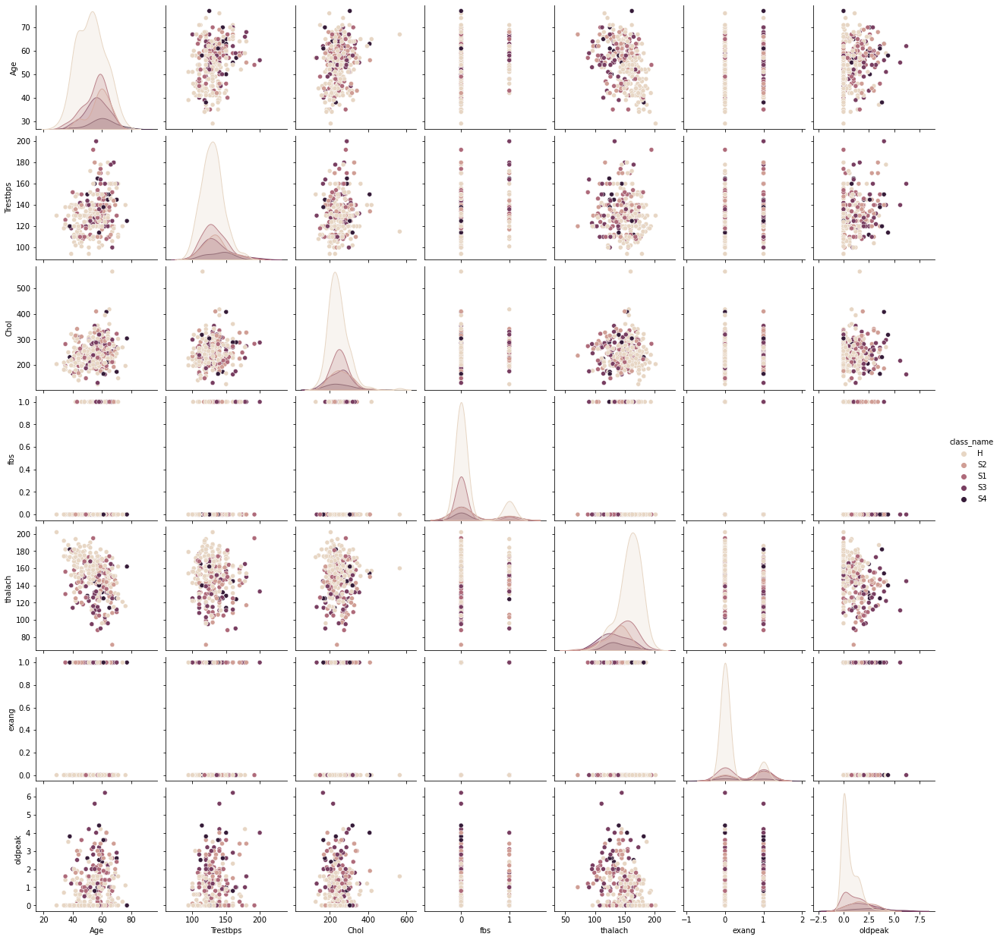
    


#### Understanding the relation between Cholestrol(Chol) and Resting Blood pressure(Trestbps) with respect to Chest pain type and gender for each class value(Sick or buff).


```python
sns.relplot(x = "Chol", y = "Trestbps", hue = "class_value",
           row = "Sex", col = "CP", data = cleve, palette="ch:.20")
```


    <seaborn.axisgrid.FacetGrid at 0x19ce70f9820>


    
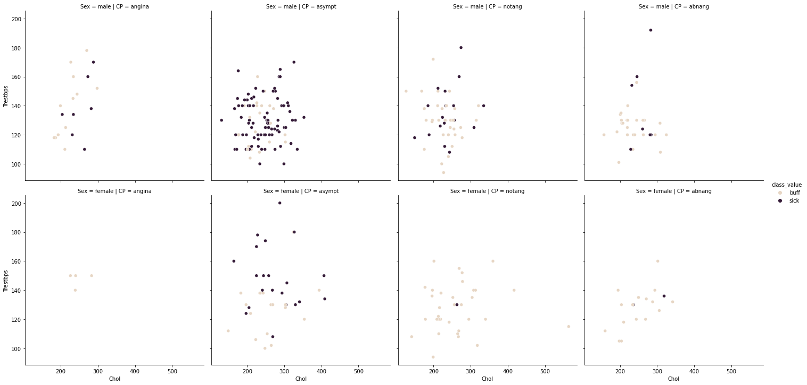
    


#### Understanding the relation between Resting ECGs(restecg) and resting BPS(Trestbps) with slope and gender for each class value


```python
sns.catplot(x = "restecg", y = "Trestbps", hue = "class_value",
           row = "Sex", col = "slope", kind = "bar", palette="ch:.20", data = cleve)
```


    <seaborn.axisgrid.FacetGrid at 0x19ce77744f0>


    
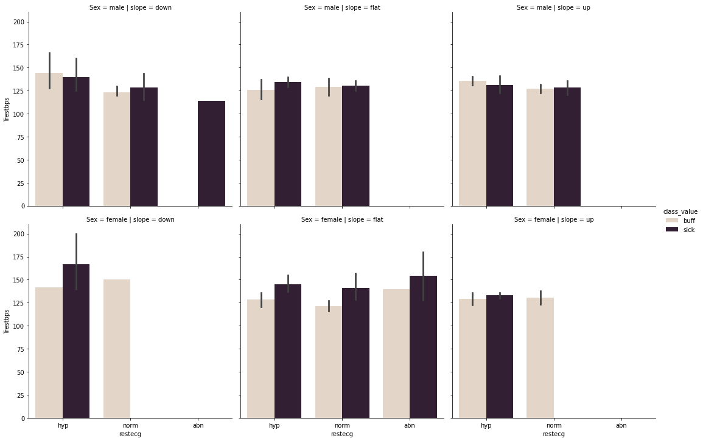
    


#### Understanding the relation between maximum heart rate(thalach, thal) and fasting BPs(fbs) with respect to gender and class value


```python
sns.catplot(x = "thal", y = "thalach", hue = "class_value",
            row = "fbs", col = "Sex",  kind = "swarm", data = cleve, palette="ch:.20")
```


    <seaborn.axisgrid.FacetGrid at 0x19ce83b70a0>


    
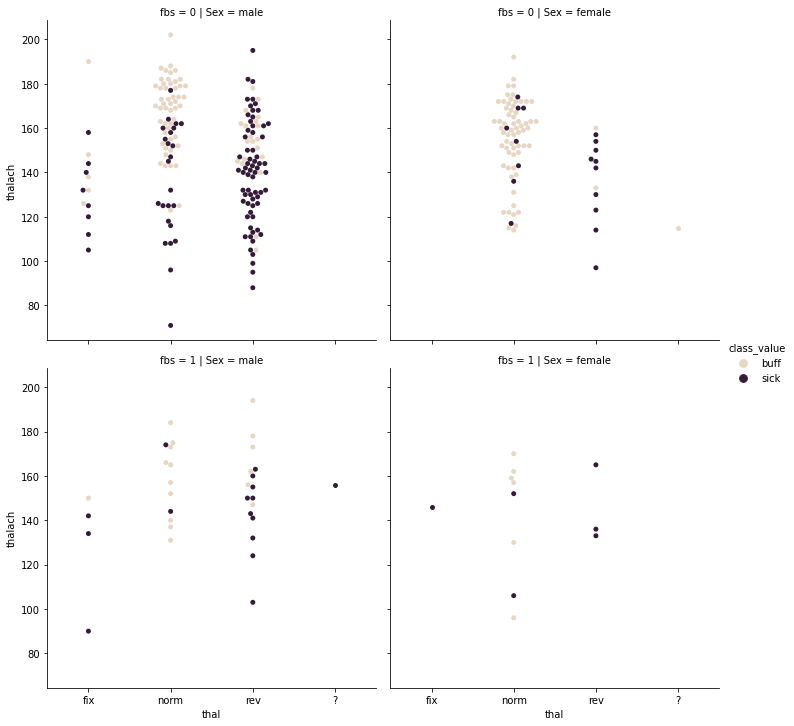
    


#### Understanding the relation between slope of the peak exercise ST segment(slope), ST depression induced by exercise relative to rest(oldpeak) and exercise induced angina(exang) for each class value and gender


```python
sns.catplot(x = "slope", y = "oldpeak", hue = "class_value",
           kind = "violin", inner = "stick", split = True,
           row = "Sex", col = "exang", palette="ch:.20", data = cleve)
```


    <seaborn.axisgrid.FacetGrid at 0x19ce7028910>


    
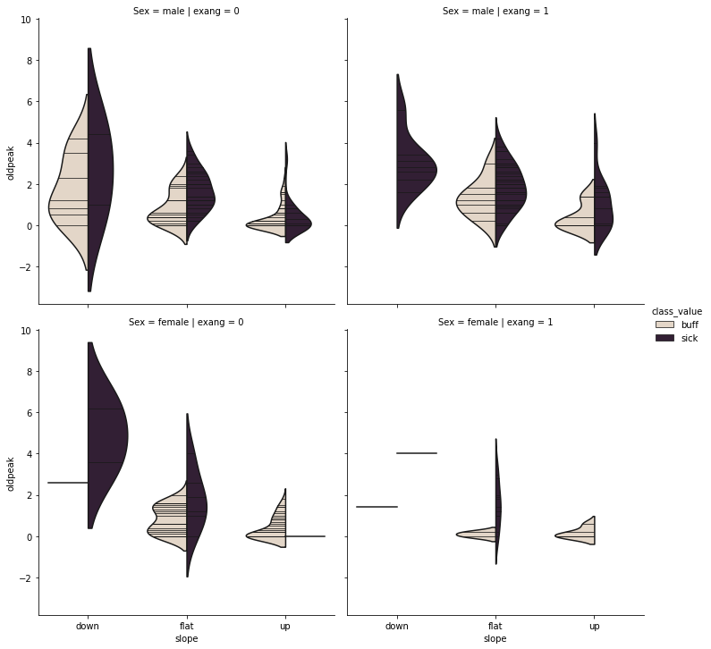
    


<a id="clean"></a>
### Cleaning Data


```python
cleve_missing = cleve.loc[cleve.isin(["?"]).any(axis=1)]
cleve_missing
```


<div>
<style scoped>
    .dataframe tbody tr th:only-of-type {
        vertical-align: middle;
    }

    .dataframe tbody tr th {
        vertical-align: top;
    }

    .dataframe thead th {
        text-align: right;
    }
</style>
<table border="1" class="dataframe">
  <thead>
    <tr style="text-align: right;">
      <th></th>
      <th>Age</th>
      <th>Sex</th>
      <th>CP</th>
      <th>Trestbps</th>
      <th>Chol</th>
      <th>fbs</th>
      <th>restecg</th>
      <th>thalach</th>
      <th>exang</th>
      <th>oldpeak</th>
      <th>slope</th>
      <th>class_attribute</th>
      <th>thal</th>
      <th>class_value</th>
      <th>class_name</th>
    </tr>
  </thead>
  <tbody>
    <tr>
      <th>82</th>
      <td>53</td>
      <td>female</td>
      <td>notang</td>
      <td>128</td>
      <td>216</td>
      <td>0</td>
      <td>hyp</td>
      <td>115</td>
      <td>0</td>
      <td>0.0</td>
      <td>up</td>
      <td>0</td>
      <td>?</td>
      <td>buff</td>
      <td>H</td>
    </tr>
    <tr>
      <th>143</th>
      <td>52</td>
      <td>male</td>
      <td>notang</td>
      <td>138</td>
      <td>223</td>
      <td>0</td>
      <td>norm</td>
      <td>169</td>
      <td>0</td>
      <td>0.0</td>
      <td>up</td>
      <td>?</td>
      <td>norm</td>
      <td>buff</td>
      <td>H</td>
    </tr>
    <tr>
      <th>157</th>
      <td>38</td>
      <td>male</td>
      <td>notang</td>
      <td>138</td>
      <td>175</td>
      <td>0</td>
      <td>norm</td>
      <td>173</td>
      <td>0</td>
      <td>0.0</td>
      <td>up</td>
      <td>?</td>
      <td>norm</td>
      <td>buff</td>
      <td>H</td>
    </tr>
    <tr>
      <th>165</th>
      <td>43</td>
      <td>male</td>
      <td>asympt</td>
      <td>132</td>
      <td>247</td>
      <td>1</td>
      <td>hyp</td>
      <td>143</td>
      <td>1</td>
      <td>0.1</td>
      <td>flat</td>
      <td>?</td>
      <td>rev</td>
      <td>sick</td>
      <td>S1</td>
    </tr>
    <tr>
      <th>198</th>
      <td>52</td>
      <td>male</td>
      <td>asympt</td>
      <td>128</td>
      <td>204</td>
      <td>1</td>
      <td>norm</td>
      <td>156</td>
      <td>1</td>
      <td>1.0</td>
      <td>flat</td>
      <td>0</td>
      <td>?</td>
      <td>sick</td>
      <td>S2</td>
    </tr>
    <tr>
      <th>250</th>
      <td>58</td>
      <td>male</td>
      <td>abnang</td>
      <td>125</td>
      <td>220</td>
      <td>0</td>
      <td>norm</td>
      <td>144</td>
      <td>0</td>
      <td>0.4</td>
      <td>flat</td>
      <td>?</td>
      <td>rev</td>
      <td>buff</td>
      <td>H</td>
    </tr>
    <tr>
      <th>262</th>
      <td>38</td>
      <td>male</td>
      <td>notang</td>
      <td>138</td>
      <td>175</td>
      <td>0</td>
      <td>norm</td>
      <td>173</td>
      <td>0</td>
      <td>0.0</td>
      <td>up</td>
      <td>?</td>
      <td>norm</td>
      <td>buff</td>
      <td>H</td>
    </tr>
  </tbody>
</table>
</div>


#### Drop the Outlier data


```python
cleve = cleve.drop(index = cleve_missing.index,axis=1)
```

#### Check for the outlier data 


```python
 cleve.loc[cleve.isin(["?"]).any(axis=1)]
```


<div>
<style scoped>
    .dataframe tbody tr th:only-of-type {
        vertical-align: middle;
    }

    .dataframe tbody tr th {
        vertical-align: top;
    }

    .dataframe thead th {
        text-align: right;
    }
</style>
<table border="1" class="dataframe">
  <thead>
    <tr style="text-align: right;">
      <th></th>
      <th>Age</th>
      <th>Sex</th>
      <th>CP</th>
      <th>Trestbps</th>
      <th>Chol</th>
      <th>fbs</th>
      <th>restecg</th>
      <th>thalach</th>
      <th>exang</th>
      <th>oldpeak</th>
      <th>slope</th>
      <th>class_attribute</th>
      <th>thal</th>
      <th>class_value</th>
      <th>class_name</th>
    </tr>
  </thead>
  <tbody>
  </tbody>
</table>
</div>


```python
cleve = cleve.reset_index()

```


```python
cleve = cleve.rename(columns = {"index":"dummy"})
cleve = cleve.drop("dummy",axis=1)
```


```python
cleve
```


<div>
<style scoped>
    .dataframe tbody tr th:only-of-type {
        vertical-align: middle;
    }

    .dataframe tbody tr th {
        vertical-align: top;
    }

    .dataframe thead th {
        text-align: right;
    }
</style>
<table border="1" class="dataframe">
  <thead>
    <tr style="text-align: right;">
      <th></th>
      <th>Age</th>
      <th>Sex</th>
      <th>CP</th>
      <th>Trestbps</th>
      <th>Chol</th>
      <th>fbs</th>
      <th>restecg</th>
      <th>thalach</th>
      <th>exang</th>
      <th>oldpeak</th>
      <th>slope</th>
      <th>class_attribute</th>
      <th>thal</th>
      <th>class_value</th>
      <th>class_name</th>
    </tr>
  </thead>
  <tbody>
    <tr>
      <th>0</th>
      <td>63</td>
      <td>male</td>
      <td>angina</td>
      <td>145</td>
      <td>233</td>
      <td>1</td>
      <td>hyp</td>
      <td>150</td>
      <td>0</td>
      <td>2.3</td>
      <td>down</td>
      <td>0</td>
      <td>fix</td>
      <td>buff</td>
      <td>H</td>
    </tr>
    <tr>
      <th>1</th>
      <td>67</td>
      <td>male</td>
      <td>asympt</td>
      <td>160</td>
      <td>286</td>
      <td>0</td>
      <td>hyp</td>
      <td>108</td>
      <td>1</td>
      <td>1.5</td>
      <td>flat</td>
      <td>3</td>
      <td>norm</td>
      <td>sick</td>
      <td>S2</td>
    </tr>
    <tr>
      <th>2</th>
      <td>67</td>
      <td>male</td>
      <td>asympt</td>
      <td>120</td>
      <td>229</td>
      <td>0</td>
      <td>hyp</td>
      <td>129</td>
      <td>1</td>
      <td>2.6</td>
      <td>flat</td>
      <td>2</td>
      <td>rev</td>
      <td>sick</td>
      <td>S1</td>
    </tr>
    <tr>
      <th>3</th>
      <td>37</td>
      <td>male</td>
      <td>notang</td>
      <td>130</td>
      <td>250</td>
      <td>0</td>
      <td>norm</td>
      <td>187</td>
      <td>0</td>
      <td>3.5</td>
      <td>down</td>
      <td>0</td>
      <td>norm</td>
      <td>buff</td>
      <td>H</td>
    </tr>
    <tr>
      <th>4</th>
      <td>41</td>
      <td>female</td>
      <td>abnang</td>
      <td>130</td>
      <td>204</td>
      <td>0</td>
      <td>hyp</td>
      <td>172</td>
      <td>0</td>
      <td>1.4</td>
      <td>up</td>
      <td>0</td>
      <td>norm</td>
      <td>buff</td>
      <td>H</td>
    </tr>
    <tr>
      <th>...</th>
      <td>...</td>
      <td>...</td>
      <td>...</td>
      <td>...</td>
      <td>...</td>
      <td>...</td>
      <td>...</td>
      <td>...</td>
      <td>...</td>
      <td>...</td>
      <td>...</td>
      <td>...</td>
      <td>...</td>
      <td>...</td>
      <td>...</td>
    </tr>
    <tr>
      <th>291</th>
      <td>48</td>
      <td>male</td>
      <td>notang</td>
      <td>124</td>
      <td>255</td>
      <td>1</td>
      <td>norm</td>
      <td>175</td>
      <td>0</td>
      <td>0.0</td>
      <td>up</td>
      <td>2</td>
      <td>norm</td>
      <td>buff</td>
      <td>H</td>
    </tr>
    <tr>
      <th>292</th>
      <td>57</td>
      <td>male</td>
      <td>asympt</td>
      <td>132</td>
      <td>207</td>
      <td>0</td>
      <td>norm</td>
      <td>168</td>
      <td>1</td>
      <td>0.0</td>
      <td>up</td>
      <td>0</td>
      <td>rev</td>
      <td>buff</td>
      <td>H</td>
    </tr>
    <tr>
      <th>293</th>
      <td>49</td>
      <td>male</td>
      <td>notang</td>
      <td>118</td>
      <td>149</td>
      <td>0</td>
      <td>hyp</td>
      <td>126</td>
      <td>0</td>
      <td>0.8</td>
      <td>up</td>
      <td>3</td>
      <td>norm</td>
      <td>sick</td>
      <td>S1</td>
    </tr>
    <tr>
      <th>294</th>
      <td>74</td>
      <td>female</td>
      <td>abnang</td>
      <td>120</td>
      <td>269</td>
      <td>0</td>
      <td>hyp</td>
      <td>121</td>
      <td>1</td>
      <td>0.2</td>
      <td>up</td>
      <td>1</td>
      <td>norm</td>
      <td>buff</td>
      <td>H</td>
    </tr>
    <tr>
      <th>295</th>
      <td>54</td>
      <td>female</td>
      <td>notang</td>
      <td>160</td>
      <td>201</td>
      <td>0</td>
      <td>norm</td>
      <td>163</td>
      <td>0</td>
      <td>0.0</td>
      <td>up</td>
      <td>1</td>
      <td>norm</td>
      <td>buff</td>
      <td>H</td>
    </tr>
  </tbody>
</table>
<p>296 rows × 15 columns</p>
</div>


##### Null or missing data verification


```python
cleve.isnull().sum()
```


    Age                0
    Sex                0
    CP                 0
    Trestbps           0
    Chol               0
    fbs                0
    restecg            0
    thalach            0
    exang              0
    oldpeak            0
    slope              0
    class_attribute    0
    thal               0
    class_value        0
    class_name         0
    dtype: int64


<a id="class"></a>
### Class distribution 


```python
cleve["class_name"].value_counts()
```


    H     160
    S1     53
    S2     35
    S3     35
    S4     13
    Name: class_name, dtype: int64


```python
count_class = sns.catplot(x="class_name", kind="count", palette="ch:.20", data = cleve)
```


    
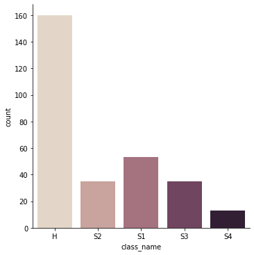
    


<a id="update"></a>
### Updating clean data


```python
writer = ExcelWriter('cleve_mod.xlsx')
cleve.to_excel(writer,'cleve',index=False)
writer.save()
```

<a id="num"></a>
### Numeric data scaling
Scaling numeric data can help avoid the outliers

    X : Scaled value
    Y : Actual value
    U : Mean
    S : Standard deviation 

    X = (Y-U)/S

###### Data types of columns


```python
cleve.dtypes
```


    Age                  int64
    Sex                 object
    CP                  object
    Trestbps             int64
    Chol                 int64
    fbs                  int64
    restecg             object
    thalach              int64
    exang                int64
    oldpeak            float64
    slope               object
    class_attribute     object
    thal                object
    class_value         object
    class_name          object
    dtype: object


###### Fetching numerical and categorical column values


```python
col = np.array(cleve.columns)
cat_col = []
num_col = []
for c in col:
    cname = cleve[c]
    if(cname.dtype == 'int64' or cname.dtype == 'float64'):
        num_col.append(c)
    elif(c != "class_name"):
        cat_col.append(c)
print("Numerical data colums name: ")
print(num_col)
print("Categorical data columns name without target: ")
print(cat_col)
```

    Numerical data colums name: 
    ['Age', 'Trestbps', 'Chol', 'fbs', 'thalach', 'exang', 'oldpeak']
    Categorical data columns name without target: 
    ['Sex', 'CP', 'restecg', 'slope', 'class_attribute', 'thal', 'class_value']
    


```python
cleve_pre = cleve.copy()
scaler = StandardScaler()
cleve_pre[num_col]=scaler.fit_transform(cleve_pre[num_col])
cleve_pre
```


<div>
<style scoped>
    .dataframe tbody tr th:only-of-type {
        vertical-align: middle;
    }

    .dataframe tbody tr th {
        vertical-align: top;
    }

    .dataframe thead th {
        text-align: right;
    }
</style>
<table border="1" class="dataframe">
  <thead>
    <tr style="text-align: right;">
      <th></th>
      <th>Age</th>
      <th>Sex</th>
      <th>CP</th>
      <th>Trestbps</th>
      <th>Chol</th>
      <th>fbs</th>
      <th>restecg</th>
      <th>thalach</th>
      <th>exang</th>
      <th>oldpeak</th>
      <th>slope</th>
      <th>class_attribute</th>
      <th>thal</th>
      <th>class_value</th>
      <th>class_name</th>
    </tr>
  </thead>
  <tbody>
    <tr>
      <th>0</th>
      <td>0.937219</td>
      <td>male</td>
      <td>angina</td>
      <td>0.756938</td>
      <td>-0.272801</td>
      <td>2.425638</td>
      <td>hyp</td>
      <td>0.019152</td>
      <td>-0.698167</td>
      <td>1.065587</td>
      <td>down</td>
      <td>0</td>
      <td>fix</td>
      <td>buff</td>
      <td>H</td>
    </tr>
    <tr>
      <th>1</th>
      <td>1.379493</td>
      <td>male</td>
      <td>asympt</td>
      <td>1.604556</td>
      <td>0.748607</td>
      <td>-0.412263</td>
      <td>hyp</td>
      <td>-1.812353</td>
      <td>1.432322</td>
      <td>0.378598</td>
      <td>flat</td>
      <td>3</td>
      <td>norm</td>
      <td>sick</td>
      <td>S2</td>
    </tr>
    <tr>
      <th>2</th>
      <td>1.379493</td>
      <td>male</td>
      <td>asympt</td>
      <td>-0.655759</td>
      <td>-0.349888</td>
      <td>-0.412263</td>
      <td>hyp</td>
      <td>-0.896601</td>
      <td>1.432322</td>
      <td>1.323208</td>
      <td>flat</td>
      <td>2</td>
      <td>rev</td>
      <td>sick</td>
      <td>S1</td>
    </tr>
    <tr>
      <th>3</th>
      <td>-1.937566</td>
      <td>male</td>
      <td>notang</td>
      <td>-0.090680</td>
      <td>0.054821</td>
      <td>-0.412263</td>
      <td>norm</td>
      <td>1.632621</td>
      <td>-0.698167</td>
      <td>2.096070</td>
      <td>down</td>
      <td>0</td>
      <td>norm</td>
      <td>buff</td>
      <td>H</td>
    </tr>
    <tr>
      <th>4</th>
      <td>-1.495292</td>
      <td>female</td>
      <td>abnang</td>
      <td>-0.090680</td>
      <td>-0.831685</td>
      <td>-0.412263</td>
      <td>hyp</td>
      <td>0.978512</td>
      <td>-0.698167</td>
      <td>0.292725</td>
      <td>up</td>
      <td>0</td>
      <td>norm</td>
      <td>buff</td>
      <td>H</td>
    </tr>
    <tr>
      <th>...</th>
      <td>...</td>
      <td>...</td>
      <td>...</td>
      <td>...</td>
      <td>...</td>
      <td>...</td>
      <td>...</td>
      <td>...</td>
      <td>...</td>
      <td>...</td>
      <td>...</td>
      <td>...</td>
      <td>...</td>
      <td>...</td>
      <td>...</td>
    </tr>
    <tr>
      <th>291</th>
      <td>-0.721311</td>
      <td>male</td>
      <td>notang</td>
      <td>-0.429727</td>
      <td>0.151180</td>
      <td>2.425638</td>
      <td>norm</td>
      <td>1.109334</td>
      <td>-0.698167</td>
      <td>-0.909506</td>
      <td>up</td>
      <td>2</td>
      <td>norm</td>
      <td>buff</td>
      <td>H</td>
    </tr>
    <tr>
      <th>292</th>
      <td>0.273807</td>
      <td>male</td>
      <td>asympt</td>
      <td>0.022336</td>
      <td>-0.773869</td>
      <td>-0.412263</td>
      <td>norm</td>
      <td>0.804083</td>
      <td>1.432322</td>
      <td>-0.909506</td>
      <td>up</td>
      <td>0</td>
      <td>rev</td>
      <td>buff</td>
      <td>H</td>
    </tr>
    <tr>
      <th>293</th>
      <td>-0.610742</td>
      <td>male</td>
      <td>notang</td>
      <td>-0.768774</td>
      <td>-1.891637</td>
      <td>-0.412263</td>
      <td>hyp</td>
      <td>-1.027423</td>
      <td>-0.698167</td>
      <td>-0.222517</td>
      <td>up</td>
      <td>3</td>
      <td>norm</td>
      <td>sick</td>
      <td>S1</td>
    </tr>
    <tr>
      <th>294</th>
      <td>2.153474</td>
      <td>female</td>
      <td>abnang</td>
      <td>-0.655759</td>
      <td>0.420986</td>
      <td>-0.412263</td>
      <td>hyp</td>
      <td>-1.245459</td>
      <td>1.432322</td>
      <td>-0.737759</td>
      <td>up</td>
      <td>1</td>
      <td>norm</td>
      <td>buff</td>
      <td>H</td>
    </tr>
    <tr>
      <th>295</th>
      <td>-0.057899</td>
      <td>female</td>
      <td>notang</td>
      <td>1.604556</td>
      <td>-0.889500</td>
      <td>-0.412263</td>
      <td>norm</td>
      <td>0.586046</td>
      <td>-0.698167</td>
      <td>-0.909506</td>
      <td>up</td>
      <td>1</td>
      <td>norm</td>
      <td>buff</td>
      <td>H</td>
    </tr>
  </tbody>
</table>
<p>296 rows × 15 columns</p>
</div>


##### Visualizing numerical data after processing


```python
num = sns.heatmap(cleve_pre[num_col].corr(),annot=True)
```


    
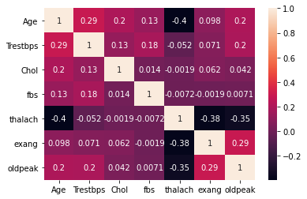
    


<a id="encode"></a>
### Encoding Categorical Data
Encoding of categorical data is done as
For column "Sex" contains "male" and "female"
forms two columns as Sex_female and Sex_male
and the values are binary 0 for False and 1 for True


```python
encoder = OneHotEncoder(sparse=False)
cleve_encode = pd.DataFrame(encoder.fit_transform(cleve[cat_col]))
cleve_encode.columns = encoder.get_feature_names(cat_col)
cleve_encode
```


<div>
<style scoped>
    .dataframe tbody tr th:only-of-type {
        vertical-align: middle;
    }

    .dataframe tbody tr th {
        vertical-align: top;
    }

    .dataframe thead th {
        text-align: right;
    }
</style>
<table border="1" class="dataframe">
  <thead>
    <tr style="text-align: right;">
      <th></th>
      <th>Sex_female</th>
      <th>Sex_male</th>
      <th>CP_abnang</th>
      <th>CP_angina</th>
      <th>CP_asympt</th>
      <th>CP_notang</th>
      <th>restecg_abn</th>
      <th>restecg_hyp</th>
      <th>restecg_norm</th>
      <th>slope_down</th>
      <th>...</th>
      <th>slope_up</th>
      <th>class_attribute_0</th>
      <th>class_attribute_1</th>
      <th>class_attribute_2</th>
      <th>class_attribute_3</th>
      <th>thal_fix</th>
      <th>thal_norm</th>
      <th>thal_rev</th>
      <th>class_value_buff</th>
      <th>class_value_sick</th>
    </tr>
  </thead>
  <tbody>
    <tr>
      <th>0</th>
      <td>0.0</td>
      <td>1.0</td>
      <td>0.0</td>
      <td>1.0</td>
      <td>0.0</td>
      <td>0.0</td>
      <td>0.0</td>
      <td>1.0</td>
      <td>0.0</td>
      <td>1.0</td>
      <td>...</td>
      <td>0.0</td>
      <td>1.0</td>
      <td>0.0</td>
      <td>0.0</td>
      <td>0.0</td>
      <td>1.0</td>
      <td>0.0</td>
      <td>0.0</td>
      <td>1.0</td>
      <td>0.0</td>
    </tr>
    <tr>
      <th>1</th>
      <td>0.0</td>
      <td>1.0</td>
      <td>0.0</td>
      <td>0.0</td>
      <td>1.0</td>
      <td>0.0</td>
      <td>0.0</td>
      <td>1.0</td>
      <td>0.0</td>
      <td>0.0</td>
      <td>...</td>
      <td>0.0</td>
      <td>0.0</td>
      <td>0.0</td>
      <td>0.0</td>
      <td>1.0</td>
      <td>0.0</td>
      <td>1.0</td>
      <td>0.0</td>
      <td>0.0</td>
      <td>1.0</td>
    </tr>
    <tr>
      <th>2</th>
      <td>0.0</td>
      <td>1.0</td>
      <td>0.0</td>
      <td>0.0</td>
      <td>1.0</td>
      <td>0.0</td>
      <td>0.0</td>
      <td>1.0</td>
      <td>0.0</td>
      <td>0.0</td>
      <td>...</td>
      <td>0.0</td>
      <td>0.0</td>
      <td>0.0</td>
      <td>1.0</td>
      <td>0.0</td>
      <td>0.0</td>
      <td>0.0</td>
      <td>1.0</td>
      <td>0.0</td>
      <td>1.0</td>
    </tr>
    <tr>
      <th>3</th>
      <td>0.0</td>
      <td>1.0</td>
      <td>0.0</td>
      <td>0.0</td>
      <td>0.0</td>
      <td>1.0</td>
      <td>0.0</td>
      <td>0.0</td>
      <td>1.0</td>
      <td>1.0</td>
      <td>...</td>
      <td>0.0</td>
      <td>1.0</td>
      <td>0.0</td>
      <td>0.0</td>
      <td>0.0</td>
      <td>0.0</td>
      <td>1.0</td>
      <td>0.0</td>
      <td>1.0</td>
      <td>0.0</td>
    </tr>
    <tr>
      <th>4</th>
      <td>1.0</td>
      <td>0.0</td>
      <td>1.0</td>
      <td>0.0</td>
      <td>0.0</td>
      <td>0.0</td>
      <td>0.0</td>
      <td>1.0</td>
      <td>0.0</td>
      <td>0.0</td>
      <td>...</td>
      <td>1.0</td>
      <td>1.0</td>
      <td>0.0</td>
      <td>0.0</td>
      <td>0.0</td>
      <td>0.0</td>
      <td>1.0</td>
      <td>0.0</td>
      <td>1.0</td>
      <td>0.0</td>
    </tr>
    <tr>
      <th>...</th>
      <td>...</td>
      <td>...</td>
      <td>...</td>
      <td>...</td>
      <td>...</td>
      <td>...</td>
      <td>...</td>
      <td>...</td>
      <td>...</td>
      <td>...</td>
      <td>...</td>
      <td>...</td>
      <td>...</td>
      <td>...</td>
      <td>...</td>
      <td>...</td>
      <td>...</td>
      <td>...</td>
      <td>...</td>
      <td>...</td>
      <td>...</td>
    </tr>
    <tr>
      <th>291</th>
      <td>0.0</td>
      <td>1.0</td>
      <td>0.0</td>
      <td>0.0</td>
      <td>0.0</td>
      <td>1.0</td>
      <td>0.0</td>
      <td>0.0</td>
      <td>1.0</td>
      <td>0.0</td>
      <td>...</td>
      <td>1.0</td>
      <td>0.0</td>
      <td>0.0</td>
      <td>1.0</td>
      <td>0.0</td>
      <td>0.0</td>
      <td>1.0</td>
      <td>0.0</td>
      <td>1.0</td>
      <td>0.0</td>
    </tr>
    <tr>
      <th>292</th>
      <td>0.0</td>
      <td>1.0</td>
      <td>0.0</td>
      <td>0.0</td>
      <td>1.0</td>
      <td>0.0</td>
      <td>0.0</td>
      <td>0.0</td>
      <td>1.0</td>
      <td>0.0</td>
      <td>...</td>
      <td>1.0</td>
      <td>1.0</td>
      <td>0.0</td>
      <td>0.0</td>
      <td>0.0</td>
      <td>0.0</td>
      <td>0.0</td>
      <td>1.0</td>
      <td>1.0</td>
      <td>0.0</td>
    </tr>
    <tr>
      <th>293</th>
      <td>0.0</td>
      <td>1.0</td>
      <td>0.0</td>
      <td>0.0</td>
      <td>0.0</td>
      <td>1.0</td>
      <td>0.0</td>
      <td>1.0</td>
      <td>0.0</td>
      <td>0.0</td>
      <td>...</td>
      <td>1.0</td>
      <td>0.0</td>
      <td>0.0</td>
      <td>0.0</td>
      <td>1.0</td>
      <td>0.0</td>
      <td>1.0</td>
      <td>0.0</td>
      <td>0.0</td>
      <td>1.0</td>
    </tr>
    <tr>
      <th>294</th>
      <td>1.0</td>
      <td>0.0</td>
      <td>1.0</td>
      <td>0.0</td>
      <td>0.0</td>
      <td>0.0</td>
      <td>0.0</td>
      <td>1.0</td>
      <td>0.0</td>
      <td>0.0</td>
      <td>...</td>
      <td>1.0</td>
      <td>0.0</td>
      <td>1.0</td>
      <td>0.0</td>
      <td>0.0</td>
      <td>0.0</td>
      <td>1.0</td>
      <td>0.0</td>
      <td>1.0</td>
      <td>0.0</td>
    </tr>
    <tr>
      <th>295</th>
      <td>1.0</td>
      <td>0.0</td>
      <td>0.0</td>
      <td>0.0</td>
      <td>0.0</td>
      <td>1.0</td>
      <td>0.0</td>
      <td>0.0</td>
      <td>1.0</td>
      <td>0.0</td>
      <td>...</td>
      <td>1.0</td>
      <td>0.0</td>
      <td>1.0</td>
      <td>0.0</td>
      <td>0.0</td>
      <td>0.0</td>
      <td>1.0</td>
      <td>0.0</td>
      <td>1.0</td>
      <td>0.0</td>
    </tr>
  </tbody>
</table>
<p>296 rows × 21 columns</p>
</div>


Arranging the processed columns together


```python
cleve_pre = cleve_pre.drop(cat_col,axis = 1)
cleve_pre = pd.concat([cleve_pre,cleve_encode], axis=1)
cleve_pre
```


<div>
<style scoped>
    .dataframe tbody tr th:only-of-type {
        vertical-align: middle;
    }

    .dataframe tbody tr th {
        vertical-align: top;
    }

    .dataframe thead th {
        text-align: right;
    }
</style>
<table border="1" class="dataframe">
  <thead>
    <tr style="text-align: right;">
      <th></th>
      <th>Age</th>
      <th>Trestbps</th>
      <th>Chol</th>
      <th>fbs</th>
      <th>thalach</th>
      <th>exang</th>
      <th>oldpeak</th>
      <th>class_name</th>
      <th>Sex_female</th>
      <th>Sex_male</th>
      <th>...</th>
      <th>slope_up</th>
      <th>class_attribute_0</th>
      <th>class_attribute_1</th>
      <th>class_attribute_2</th>
      <th>class_attribute_3</th>
      <th>thal_fix</th>
      <th>thal_norm</th>
      <th>thal_rev</th>
      <th>class_value_buff</th>
      <th>class_value_sick</th>
    </tr>
  </thead>
  <tbody>
    <tr>
      <th>0</th>
      <td>0.937219</td>
      <td>0.756938</td>
      <td>-0.272801</td>
      <td>2.425638</td>
      <td>0.019152</td>
      <td>-0.698167</td>
      <td>1.065587</td>
      <td>H</td>
      <td>0.0</td>
      <td>1.0</td>
      <td>...</td>
      <td>0.0</td>
      <td>1.0</td>
      <td>0.0</td>
      <td>0.0</td>
      <td>0.0</td>
      <td>1.0</td>
      <td>0.0</td>
      <td>0.0</td>
      <td>1.0</td>
      <td>0.0</td>
    </tr>
    <tr>
      <th>1</th>
      <td>1.379493</td>
      <td>1.604556</td>
      <td>0.748607</td>
      <td>-0.412263</td>
      <td>-1.812353</td>
      <td>1.432322</td>
      <td>0.378598</td>
      <td>S2</td>
      <td>0.0</td>
      <td>1.0</td>
      <td>...</td>
      <td>0.0</td>
      <td>0.0</td>
      <td>0.0</td>
      <td>0.0</td>
      <td>1.0</td>
      <td>0.0</td>
      <td>1.0</td>
      <td>0.0</td>
      <td>0.0</td>
      <td>1.0</td>
    </tr>
    <tr>
      <th>2</th>
      <td>1.379493</td>
      <td>-0.655759</td>
      <td>-0.349888</td>
      <td>-0.412263</td>
      <td>-0.896601</td>
      <td>1.432322</td>
      <td>1.323208</td>
      <td>S1</td>
      <td>0.0</td>
      <td>1.0</td>
      <td>...</td>
      <td>0.0</td>
      <td>0.0</td>
      <td>0.0</td>
      <td>1.0</td>
      <td>0.0</td>
      <td>0.0</td>
      <td>0.0</td>
      <td>1.0</td>
      <td>0.0</td>
      <td>1.0</td>
    </tr>
    <tr>
      <th>3</th>
      <td>-1.937566</td>
      <td>-0.090680</td>
      <td>0.054821</td>
      <td>-0.412263</td>
      <td>1.632621</td>
      <td>-0.698167</td>
      <td>2.096070</td>
      <td>H</td>
      <td>0.0</td>
      <td>1.0</td>
      <td>...</td>
      <td>0.0</td>
      <td>1.0</td>
      <td>0.0</td>
      <td>0.0</td>
      <td>0.0</td>
      <td>0.0</td>
      <td>1.0</td>
      <td>0.0</td>
      <td>1.0</td>
      <td>0.0</td>
    </tr>
    <tr>
      <th>4</th>
      <td>-1.495292</td>
      <td>-0.090680</td>
      <td>-0.831685</td>
      <td>-0.412263</td>
      <td>0.978512</td>
      <td>-0.698167</td>
      <td>0.292725</td>
      <td>H</td>
      <td>1.0</td>
      <td>0.0</td>
      <td>...</td>
      <td>1.0</td>
      <td>1.0</td>
      <td>0.0</td>
      <td>0.0</td>
      <td>0.0</td>
      <td>0.0</td>
      <td>1.0</td>
      <td>0.0</td>
      <td>1.0</td>
      <td>0.0</td>
    </tr>
    <tr>
      <th>...</th>
      <td>...</td>
      <td>...</td>
      <td>...</td>
      <td>...</td>
      <td>...</td>
      <td>...</td>
      <td>...</td>
      <td>...</td>
      <td>...</td>
      <td>...</td>
      <td>...</td>
      <td>...</td>
      <td>...</td>
      <td>...</td>
      <td>...</td>
      <td>...</td>
      <td>...</td>
      <td>...</td>
      <td>...</td>
      <td>...</td>
      <td>...</td>
    </tr>
    <tr>
      <th>291</th>
      <td>-0.721311</td>
      <td>-0.429727</td>
      <td>0.151180</td>
      <td>2.425638</td>
      <td>1.109334</td>
      <td>-0.698167</td>
      <td>-0.909506</td>
      <td>H</td>
      <td>0.0</td>
      <td>1.0</td>
      <td>...</td>
      <td>1.0</td>
      <td>0.0</td>
      <td>0.0</td>
      <td>1.0</td>
      <td>0.0</td>
      <td>0.0</td>
      <td>1.0</td>
      <td>0.0</td>
      <td>1.0</td>
      <td>0.0</td>
    </tr>
    <tr>
      <th>292</th>
      <td>0.273807</td>
      <td>0.022336</td>
      <td>-0.773869</td>
      <td>-0.412263</td>
      <td>0.804083</td>
      <td>1.432322</td>
      <td>-0.909506</td>
      <td>H</td>
      <td>0.0</td>
      <td>1.0</td>
      <td>...</td>
      <td>1.0</td>
      <td>1.0</td>
      <td>0.0</td>
      <td>0.0</td>
      <td>0.0</td>
      <td>0.0</td>
      <td>0.0</td>
      <td>1.0</td>
      <td>1.0</td>
      <td>0.0</td>
    </tr>
    <tr>
      <th>293</th>
      <td>-0.610742</td>
      <td>-0.768774</td>
      <td>-1.891637</td>
      <td>-0.412263</td>
      <td>-1.027423</td>
      <td>-0.698167</td>
      <td>-0.222517</td>
      <td>S1</td>
      <td>0.0</td>
      <td>1.0</td>
      <td>...</td>
      <td>1.0</td>
      <td>0.0</td>
      <td>0.0</td>
      <td>0.0</td>
      <td>1.0</td>
      <td>0.0</td>
      <td>1.0</td>
      <td>0.0</td>
      <td>0.0</td>
      <td>1.0</td>
    </tr>
    <tr>
      <th>294</th>
      <td>2.153474</td>
      <td>-0.655759</td>
      <td>0.420986</td>
      <td>-0.412263</td>
      <td>-1.245459</td>
      <td>1.432322</td>
      <td>-0.737759</td>
      <td>H</td>
      <td>1.0</td>
      <td>0.0</td>
      <td>...</td>
      <td>1.0</td>
      <td>0.0</td>
      <td>1.0</td>
      <td>0.0</td>
      <td>0.0</td>
      <td>0.0</td>
      <td>1.0</td>
      <td>0.0</td>
      <td>1.0</td>
      <td>0.0</td>
    </tr>
    <tr>
      <th>295</th>
      <td>-0.057899</td>
      <td>1.604556</td>
      <td>-0.889500</td>
      <td>-0.412263</td>
      <td>0.586046</td>
      <td>-0.698167</td>
      <td>-0.909506</td>
      <td>H</td>
      <td>1.0</td>
      <td>0.0</td>
      <td>...</td>
      <td>1.0</td>
      <td>0.0</td>
      <td>1.0</td>
      <td>0.0</td>
      <td>0.0</td>
      <td>0.0</td>
      <td>1.0</td>
      <td>0.0</td>
      <td>1.0</td>
      <td>0.0</td>
    </tr>
  </tbody>
</table>
<p>296 rows × 29 columns</p>
</div>


##### Encoding target labels data


```python
cleve_pre["class_name"].unique()
```


    array(['H', 'S2', 'S1', 'S3', 'S4'], dtype=object)


Here, Target label has 5 types of values. Hence each value is given a numeric value
'H'=0, 'S2'=2, 'S1'=1, 'S3'=3, 'S4'=4


```python
cleve_pre["class_name"] = cleve_pre["class_name"].replace({"H":0,"S1":1,"S2":2,"S3":3,"S4":4})
cleve_pre["class_name"].unique()
```


    array([0, 2, 1, 3, 4], dtype=int64)


```python
from pandas import ExcelWriter
from pandas import ExcelFile

writer = ExcelWriter('cleve_encoded.xlsx')
cleve_pre.to_excel(writer,'cleve',index=False)
writer.save()
```

<a id="statistics"></a>
### Statistics of cleve data


```python
cleve_pre.describe()
```


<div>
<style scoped>
    .dataframe tbody tr th:only-of-type {
        vertical-align: middle;
    }

    .dataframe tbody tr th {
        vertical-align: top;
    }

    .dataframe thead th {
        text-align: right;
    }
</style>
<table border="1" class="dataframe">
  <thead>
    <tr style="text-align: right;">
      <th></th>
      <th>Age</th>
      <th>Trestbps</th>
      <th>Chol</th>
      <th>fbs</th>
      <th>thalach</th>
      <th>exang</th>
      <th>oldpeak</th>
      <th>class_name</th>
      <th>Sex_female</th>
      <th>Sex_male</th>
      <th>...</th>
      <th>slope_up</th>
      <th>class_attribute_0</th>
      <th>class_attribute_1</th>
      <th>class_attribute_2</th>
      <th>class_attribute_3</th>
      <th>thal_fix</th>
      <th>thal_norm</th>
      <th>thal_rev</th>
      <th>class_value_buff</th>
      <th>class_value_sick</th>
    </tr>
  </thead>
  <tbody>
    <tr>
      <th>count</th>
      <td>2.960000e+02</td>
      <td>2.960000e+02</td>
      <td>2.960000e+02</td>
      <td>2.960000e+02</td>
      <td>2.960000e+02</td>
      <td>2.960000e+02</td>
      <td>2.960000e+02</td>
      <td>296.000000</td>
      <td>296.000000</td>
      <td>296.000000</td>
      <td>...</td>
      <td>296.000000</td>
      <td>296.000000</td>
      <td>296.000000</td>
      <td>296.000000</td>
      <td>296.000000</td>
      <td>296.000000</td>
      <td>296.000000</td>
      <td>296.000000</td>
      <td>296.000000</td>
      <td>296.000000</td>
    </tr>
    <tr>
      <th>mean</th>
      <td>3.575640e-16</td>
      <td>-6.406287e-16</td>
      <td>-2.633029e-16</td>
      <td>5.663638e-17</td>
      <td>1.729097e-16</td>
      <td>2.280458e-16</td>
      <td>2.362975e-17</td>
      <td>0.945946</td>
      <td>0.320946</td>
      <td>0.679054</td>
      <td>...</td>
      <td>0.466216</td>
      <td>0.584459</td>
      <td>0.219595</td>
      <td>0.128378</td>
      <td>0.067568</td>
      <td>0.060811</td>
      <td>0.550676</td>
      <td>0.388514</td>
      <td>0.540541</td>
      <td>0.459459</td>
    </tr>
    <tr>
      <th>std</th>
      <td>1.001693e+00</td>
      <td>1.001693e+00</td>
      <td>1.001693e+00</td>
      <td>1.001693e+00</td>
      <td>1.001693e+00</td>
      <td>1.001693e+00</td>
      <td>1.001693e+00</td>
      <td>1.236637</td>
      <td>0.467631</td>
      <td>0.467631</td>
      <td>...</td>
      <td>0.499702</td>
      <td>0.493650</td>
      <td>0.414673</td>
      <td>0.335077</td>
      <td>0.251427</td>
      <td>0.239388</td>
      <td>0.498268</td>
      <td>0.488238</td>
      <td>0.499198</td>
      <td>0.499198</td>
    </tr>
    <tr>
      <th>min</th>
      <td>-2.822115e+00</td>
      <td>-2.124963e+00</td>
      <td>-2.334890e+00</td>
      <td>-4.122626e-01</td>
      <td>-3.425822e+00</td>
      <td>-6.981670e-01</td>
      <td>-9.095059e-01</td>
      <td>0.000000</td>
      <td>0.000000</td>
      <td>0.000000</td>
      <td>...</td>
      <td>0.000000</td>
      <td>0.000000</td>
      <td>0.000000</td>
      <td>0.000000</td>
      <td>0.000000</td>
      <td>0.000000</td>
      <td>0.000000</td>
      <td>0.000000</td>
      <td>0.000000</td>
      <td>0.000000</td>
    </tr>
    <tr>
      <th>25%</th>
      <td>-7.213110e-01</td>
      <td>-6.557585e-01</td>
      <td>-6.967818e-01</td>
      <td>-4.122626e-01</td>
      <td>-7.221717e-01</td>
      <td>-6.981670e-01</td>
      <td>-9.095059e-01</td>
      <td>0.000000</td>
      <td>0.000000</td>
      <td>0.000000</td>
      <td>...</td>
      <td>0.000000</td>
      <td>0.000000</td>
      <td>0.000000</td>
      <td>0.000000</td>
      <td>0.000000</td>
      <td>0.000000</td>
      <td>0.000000</td>
      <td>0.000000</td>
      <td>0.000000</td>
      <td>0.000000</td>
    </tr>
    <tr>
      <th>50%</th>
      <td>1.632382e-01</td>
      <td>-9.067985e-02</td>
      <td>-8.971830e-02</td>
      <td>-4.122626e-01</td>
      <td>1.281700e-01</td>
      <td>-6.981670e-01</td>
      <td>-2.225171e-01</td>
      <td>0.000000</td>
      <td>0.000000</td>
      <td>1.000000</td>
      <td>...</td>
      <td>0.000000</td>
      <td>1.000000</td>
      <td>0.000000</td>
      <td>0.000000</td>
      <td>0.000000</td>
      <td>0.000000</td>
      <td>1.000000</td>
      <td>0.000000</td>
      <td>1.000000</td>
      <td>0.000000</td>
    </tr>
    <tr>
      <th>75%</th>
      <td>7.160814e-01</td>
      <td>4.743988e-01</td>
      <td>5.414350e-01</td>
      <td>-4.122626e-01</td>
      <td>7.168681e-01</td>
      <td>1.432322e+00</td>
      <td>5.074085e-01</td>
      <td>2.000000</td>
      <td>1.000000</td>
      <td>1.000000</td>
      <td>...</td>
      <td>1.000000</td>
      <td>1.000000</td>
      <td>0.000000</td>
      <td>0.000000</td>
      <td>0.000000</td>
      <td>0.000000</td>
      <td>1.000000</td>
      <td>1.000000</td>
      <td>1.000000</td>
      <td>1.000000</td>
    </tr>
    <tr>
      <th>max</th>
      <td>2.485180e+00</td>
      <td>3.864871e+00</td>
      <td>6.106183e+00</td>
      <td>2.425638e+00</td>
      <td>2.286730e+00</td>
      <td>1.432322e+00</td>
      <td>4.414657e+00</td>
      <td>4.000000</td>
      <td>1.000000</td>
      <td>1.000000</td>
      <td>...</td>
      <td>1.000000</td>
      <td>1.000000</td>
      <td>1.000000</td>
      <td>1.000000</td>
      <td>1.000000</td>
      <td>1.000000</td>
      <td>1.000000</td>
      <td>1.000000</td>
      <td>1.000000</td>
      <td>1.000000</td>
    </tr>
  </tbody>
</table>
<p>8 rows × 29 columns</p>
</div>


<a id="classification"></a>
## Step 2: Classification Model

<a id="feature"></a>
### Feature vector:
Splitting the feature vector from the excel data cleve


```python
import numpy as np

feature_vector =  np.array(cleve_pre.drop("class_name",axis=1))
fcol_len = len(feature_vector)
print(fcol_len)
feature_vector
```

    296
    


    array([[ 0.93721873,  0.75693814, -0.27280094, ...,  0.        ,
             1.        ,  0.        ],
           [ 1.37949333,  1.60455613,  0.74860744, ...,  0.        ,
             0.        ,  1.        ],
           [ 1.37949333, -0.65575852, -0.34988836, ...,  1.        ,
             0.        ,  1.        ],
           ...,
           [-0.61074237, -0.76877425, -1.89163686, ...,  0.        ,
             0.        ,  1.        ],
           [ 2.15347388, -0.65575852,  0.42098589, ...,  0.        ,
             1.        ,  0.        ],
           [-0.05789912,  1.60455613, -0.88950034, ...,  0.        ,
             1.        ,  0.        ]])


<a id="target"></a>
### Target labels:
Splitting the target labels from the excel data cleve


```python
target_labels = np.array(cleve_pre["class_name"])
target_labels
```


    array([0, 2, 1, 0, 0, 0, 3, 0, 2, 1, 0, 0, 2, 0, 0, 0, 0, 1, 3, 4, 0, 0,
           0, 0, 3, 0, 2, 1, 0, 0, 0, 3, 1, 3, 0, 4, 0, 0, 0, 1, 4, 0, 4, 0,
           0, 0, 0, 2, 0, 1, 1, 1, 1, 0, 0, 2, 0, 1, 0, 2, 2, 1, 0, 2, 1, 0,
           3, 1, 1, 1, 0, 1, 0, 0, 3, 0, 0, 0, 3, 0, 0, 0, 0, 0, 0, 3, 0, 0,
           0, 1, 2, 3, 0, 0, 0, 2, 3, 1, 1, 0, 2, 2, 0, 0, 0, 3, 2, 3, 4, 0,
           3, 0, 0, 0, 0, 4, 3, 1, 0, 0, 1, 0, 1, 0, 1, 4, 0, 0, 0, 0, 0, 0,
           4, 3, 1, 1, 1, 2, 0, 1, 0, 3, 0, 1, 0, 4, 1, 0, 1, 0, 0, 3, 2, 0,
           0, 0, 0, 2, 1, 2, 0, 3, 2, 0, 3, 0, 0, 0, 1, 0, 0, 0, 0, 0, 3, 3,
           3, 0, 1, 0, 4, 0, 3, 1, 0, 0, 0, 0, 0, 0, 0, 0, 3, 1, 0, 0, 0, 3,
           2, 0, 2, 3, 2, 1, 0, 0, 0, 0, 0, 2, 0, 2, 2, 1, 3, 0, 0, 1, 0, 0,
           0, 0, 0, 0, 0, 1, 2, 1, 0, 1, 0, 2, 0, 1, 0, 0, 0, 1, 0, 2, 0, 3,
           0, 2, 4, 0, 2, 2, 1, 0, 3, 1, 1, 2, 3, 1, 2, 0, 0, 1, 0, 0, 1, 0,
           0, 0, 0, 0, 3, 0, 2, 1, 1, 0, 3, 3, 0, 0, 0, 0, 0, 3, 0, 0, 4, 2,
           0, 0, 4, 0, 0, 0, 0, 1, 0, 0], dtype=int64)


<a id="split"></a>
### Splitting the train and test data


```python
TEST_SIZE = 0.20
RANDOM_STATE = 42

cleve_pre = pd.read_excel("cleve_encoded.xlsx")
feature_len = len(cleve_pre.columns)-1
n_class = len(cleve_pre["class_name"].unique())
feature_vector =  np.array(cleve_pre.drop("class_name",axis=1))
target_labels = np.array(cleve_pre["class_name"])
train, test, train_labels, test_labels = train_test_split(feature_vector, 
                                                    target_labels, 
                                                    test_size=TEST_SIZE,
                                                    random_state=RANDOM_STATE)

print("Shape of train feature: ",train.shape)
print("Shape of test feature: ",test.shape)
print("Shape of train labels feature: ",train_labels.shape)
print("Shape of test labels feature: ",test_labels.shape)
    
```

    Shape of train feature:  (236, 28)
    Shape of test feature:  (60, 28)
    Shape of train labels feature:  (236,)
    Shape of test labels feature:  (60,)
    

<a id="dataset"></a>
### Create a dataset class for model


```python
class heartDataset(Dataset):
    
    def __init__(self, x, y):
        self.x = x
        self.y = y
        
    def __getitem__(self, idx):
        return self.x[idx], self.y[idx]
        
    def __len__ (self):
        return len(self.x)
```

<a id="model"></a>
### Classification Model Class
Five class classification is constructed using linear perceptron with 3 layers:
1. Input layer of size equal to number of features.
2. Hidden layer of size 50.
3. Output layer of size equal to number of classes.
4.Batch normalization and rectified linear functions are used with dropout of 0.2.


```python
class FiveClassClassification(nn.Module):
    def __init__(self, num_feature, num_class):
        super(FiveClassClassification, self).__init__()
        
        self.layer_1 = nn.Linear(num_feature, 50)
        self.layer_out = nn.Linear(50, num_class) 
        
        self.relu = nn.ReLU()
        self.dropout = nn.Dropout(p=0.2)
        self.batchnorm1 = nn.BatchNorm1d(50)
        
    def forward(self, x):
        x = self.layer_1(x)
        x = self.batchnorm1(x)
        x = self.relu(x)
        
        x = self.layer_out(x)
        
        return x
```

#### Accuracy Method


```python
def accuracy_(y_pred, y_test):
    y_pred_softmax = T.softmax(y_pred, dim = 1)
    _, y_pred_tags = T.max(y_pred_softmax, dim = 1)    
    correct_pred = (y_pred_tags == y_test).float()
    return T.round((correct_pred.sum() / len(correct_pred)) * 100)
```

#### Creating dataset object for train and test


```python
train_ds = heartDataset(T.from_numpy(train).float(),
                            T.from_numpy(train_labels).long())
test_ds = heartDataset(T.from_numpy(test).float(),
                            T.from_numpy(test_labels).long())

```

##### Assigning number of Epochs, batch size and learning rates for perceptrons


```python
EPOCHS = 300
BATCH_SIZE = 16
LEARNING_RATE = 0.0007
```

#### Creating Data loader objects for train and test 


```python
test_loader = DataLoader(dataset=test_ds, batch_size=1)

train_loader = DataLoader(dataset=train_ds,
                          batch_size=BATCH_SIZE)
```

#### Create a device object to run the model


```python
device = T.device("cpu")
print(device)
```

    cpu
    

#### Creating the model object for FiveClassClassifier with optimizer and loss value


```python
model = FiveClassClassification(num_feature = feature_len, num_class=n_class)
model.to(device)

criterion = nn.CrossEntropyLoss()
optimizer = optim.Adam(model.parameters(), lr=LEARNING_RATE)

print(model)
```

    FiveClassClassification(
      (layer_1): Linear(in_features=28, out_features=50, bias=True)
      (layer_out): Linear(in_features=50, out_features=5, bias=True)
      (relu): ReLU()
      (dropout): Dropout(p=0.2, inplace=False)
      (batchnorm1): BatchNorm1d(50, eps=1e-05, momentum=0.1, affine=True, track_running_stats=True)
    )
    

##### Creating a json object to store the epoch number, accuracy and loss to create graphs.


```python
epochs = {
    "epochNo":[],
    "Accuracy":[],
    "Loss":[] 
}
```

<a id="train"></a>
### Training the model


```python
print("Begin training .....")
for e in tqdm(range(1, EPOCHS+1)):
    
    train_el = 0
    train_ea = 0
    
    model.train()
    for train_x, train_y in train_loader:
        train_x, train_y = train_x.to(device), train_y.to(device)
        optimizer.zero_grad()
        
        y_train_pred = model(train_x)
        
        loss = criterion(y_train_pred, train_y)
        acc = accuracy_(y_train_pred, train_y)
        
        loss.backward()
        optimizer.step()
        
        train_el += loss.item()
        train_ea += acc.item()
        
        
    epochs['epochNo'].append(e)
    epochs['Loss'].append(train_el/len(train_loader))
    epochs['Accuracy'].append(train_ea/len(train_loader))
                            
    
    print(f'Epoch No {e} | Training Loss: {train_el/len(train_loader):.5f} | Training Accuracy: {train_ea/len(train_loader):.3f}|')

```

    Begin training .....
    


      0%|          | 0/300 [00:00<?, ?it/s]


    Epoch No 1 | Training Loss: 1.62200 | Training Accuracy: 23.133|
    Epoch No 2 | Training Loss: 1.43949 | Training Accuracy: 50.133|
    Epoch No 3 | Training Loss: 1.29294 | Training Accuracy: 64.067|
    Epoch No 4 | Training Loss: 1.17165 | Training Accuracy: 68.400|
    Epoch No 5 | Training Loss: 1.07224 | Training Accuracy: 67.867|
    Epoch No 6 | Training Loss: 0.99138 | Training Accuracy: 67.800|
    Epoch No 7 | Training Loss: 0.92500 | Training Accuracy: 69.133|
    Epoch No 8 | Training Loss: 0.87019 | Training Accuracy: 69.133|
    Epoch No 9 | Training Loss: 0.82350 | Training Accuracy: 72.067|
    Epoch No 10 | Training Loss: 0.78273 | Training Accuracy: 72.867|
    Epoch No 11 | Training Loss: 0.74649 | Training Accuracy: 74.133|
    Epoch No 12 | Training Loss: 0.71379 | Training Accuracy: 77.867|
    Epoch No 13 | Training Loss: 0.68416 | Training Accuracy: 80.333|
    Epoch No 14 | Training Loss: 0.65710 | Training Accuracy: 81.200|
    Epoch No 15 | Training Loss: 0.63223 | Training Accuracy: 81.200|
    Epoch No 16 | Training Loss: 0.60939 | Training Accuracy: 82.600|
    Epoch No 17 | Training Loss: 0.58819 | Training Accuracy: 83.933|
    Epoch No 18 | Training Loss: 0.56849 | Training Accuracy: 83.933|
    Epoch No 19 | Training Loss: 0.55002 | Training Accuracy: 83.933|
    Epoch No 20 | Training Loss: 0.53297 | Training Accuracy: 84.867|
    Epoch No 21 | Training Loss: 0.51700 | Training Accuracy: 85.267|
    Epoch No 22 | Training Loss: 0.50219 | Training Accuracy: 85.867|
    Epoch No 23 | Training Loss: 0.48798 | Training Accuracy: 85.867|
    Epoch No 24 | Training Loss: 0.47498 | Training Accuracy: 86.267|
    Epoch No 25 | Training Loss: 0.46269 | Training Accuracy: 87.133|
    Epoch No 26 | Training Loss: 0.45131 | Training Accuracy: 87.133|
    Epoch No 27 | Training Loss: 0.44050 | Training Accuracy: 87.133|
    Epoch No 28 | Training Loss: 0.43006 | Training Accuracy: 87.133|
    Epoch No 29 | Training Loss: 0.42046 | Training Accuracy: 87.533|
    Epoch No 30 | Training Loss: 0.41130 | Training Accuracy: 87.533|
    Epoch No 31 | Training Loss: 0.40234 | Training Accuracy: 88.400|
    Epoch No 32 | Training Loss: 0.39386 | Training Accuracy: 88.400|
    Epoch No 33 | Training Loss: 0.38532 | Training Accuracy: 88.400|
    Epoch No 34 | Training Loss: 0.37745 | Training Accuracy: 88.800|
    Epoch No 35 | Training Loss: 0.36986 | Training Accuracy: 88.800|
    Epoch No 36 | Training Loss: 0.36196 | Training Accuracy: 88.800|
    Epoch No 37 | Training Loss: 0.35472 | Training Accuracy: 89.333|
    Epoch No 38 | Training Loss: 0.34774 | Training Accuracy: 89.333|
    Epoch No 39 | Training Loss: 0.34063 | Training Accuracy: 89.800|
    Epoch No 40 | Training Loss: 0.33384 | Training Accuracy: 90.200|
    Epoch No 41 | Training Loss: 0.32723 | Training Accuracy: 90.200|
    Epoch No 42 | Training Loss: 0.32090 | Training Accuracy: 90.600|
    Epoch No 43 | Training Loss: 0.31437 | Training Accuracy: 91.067|
    Epoch No 44 | Training Loss: 0.30846 | Training Accuracy: 91.067|
    Epoch No 45 | Training Loss: 0.30243 | Training Accuracy: 91.467|
    Epoch No 46 | Training Loss: 0.29645 | Training Accuracy: 91.467|
    Epoch No 47 | Training Loss: 0.29085 | Training Accuracy: 91.933|
    Epoch No 48 | Training Loss: 0.28529 | Training Accuracy: 92.333|
    Epoch No 49 | Training Loss: 0.27969 | Training Accuracy: 92.733|
    Epoch No 50 | Training Loss: 0.27446 | Training Accuracy: 93.133|
    Epoch No 51 | Training Loss: 0.26915 | Training Accuracy: 93.133|
    Epoch No 52 | Training Loss: 0.26395 | Training Accuracy: 93.533|
    Epoch No 53 | Training Loss: 0.25885 | Training Accuracy: 93.533|
    Epoch No 54 | Training Loss: 0.25399 | Training Accuracy: 94.333|
    Epoch No 55 | Training Loss: 0.24915 | Training Accuracy: 94.333|
    Epoch No 56 | Training Loss: 0.24459 | Training Accuracy: 94.733|
    Epoch No 57 | Training Loss: 0.24002 | Training Accuracy: 94.733|
    Epoch No 58 | Training Loss: 0.23524 | Training Accuracy: 94.733|
    Epoch No 59 | Training Loss: 0.23085 | Training Accuracy: 94.733|
    Epoch No 60 | Training Loss: 0.22608 | Training Accuracy: 95.600|
    Epoch No 61 | Training Loss: 0.22177 | Training Accuracy: 95.600|
    Epoch No 62 | Training Loss: 0.21754 | Training Accuracy: 95.600|
    Epoch No 63 | Training Loss: 0.21300 | Training Accuracy: 96.400|
    Epoch No 64 | Training Loss: 0.20914 | Training Accuracy: 96.400|
    Epoch No 65 | Training Loss: 0.20472 | Training Accuracy: 96.800|
    Epoch No 66 | Training Loss: 0.20070 | Training Accuracy: 96.800|
    Epoch No 67 | Training Loss: 0.19688 | Training Accuracy: 96.800|
    Epoch No 68 | Training Loss: 0.19252 | Training Accuracy: 97.200|
    Epoch No 69 | Training Loss: 0.18903 | Training Accuracy: 97.600|
    Epoch No 70 | Training Loss: 0.18484 | Training Accuracy: 97.600|
    Epoch No 71 | Training Loss: 0.18114 | Training Accuracy: 97.600|
    Epoch No 72 | Training Loss: 0.17743 | Training Accuracy: 97.600|
    Epoch No 73 | Training Loss: 0.17396 | Training Accuracy: 98.400|
    Epoch No 74 | Training Loss: 0.17031 | Training Accuracy: 98.400|
    Epoch No 75 | Training Loss: 0.16686 | Training Accuracy: 98.400|
    Epoch No 76 | Training Loss: 0.16342 | Training Accuracy: 98.400|
    Epoch No 77 | Training Loss: 0.15999 | Training Accuracy: 98.800|
    Epoch No 78 | Training Loss: 0.15667 | Training Accuracy: 99.200|
    Epoch No 79 | Training Loss: 0.15347 | Training Accuracy: 99.200|
    Epoch No 80 | Training Loss: 0.15004 | Training Accuracy: 99.200|
    Epoch No 81 | Training Loss: 0.14700 | Training Accuracy: 99.200|
    Epoch No 82 | Training Loss: 0.14393 | Training Accuracy: 99.200|
    Epoch No 83 | Training Loss: 0.14058 | Training Accuracy: 99.200|
    Epoch No 84 | Training Loss: 0.13752 | Training Accuracy: 99.200|
    Epoch No 85 | Training Loss: 0.13486 | Training Accuracy: 99.200|
    Epoch No 86 | Training Loss: 0.13168 | Training Accuracy: 99.200|
    Epoch No 87 | Training Loss: 0.12882 | Training Accuracy: 99.200|
    Epoch No 88 | Training Loss: 0.12591 | Training Accuracy: 99.200|
    Epoch No 89 | Training Loss: 0.12341 | Training Accuracy: 99.200|
    Epoch No 90 | Training Loss: 0.12033 | Training Accuracy: 99.200|
    Epoch No 91 | Training Loss: 0.11785 | Training Accuracy: 99.200|
    Epoch No 92 | Training Loss: 0.11526 | Training Accuracy: 99.200|
    Epoch No 93 | Training Loss: 0.11283 | Training Accuracy: 99.200|
    Epoch No 94 | Training Loss: 0.11035 | Training Accuracy: 99.200|
    Epoch No 95 | Training Loss: 0.10783 | Training Accuracy: 99.200|
    Epoch No 96 | Training Loss: 0.10577 | Training Accuracy: 99.200|
    Epoch No 97 | Training Loss: 0.10339 | Training Accuracy: 99.200|
    Epoch No 98 | Training Loss: 0.10087 | Training Accuracy: 99.200|
    Epoch No 99 | Training Loss: 0.09889 | Training Accuracy: 99.200|
    Epoch No 100 | Training Loss: 0.09649 | Training Accuracy: 99.200|
    Epoch No 101 | Training Loss: 0.09446 | Training Accuracy: 99.600|
    Epoch No 102 | Training Loss: 0.09254 | Training Accuracy: 99.600|
    Epoch No 103 | Training Loss: 0.09038 | Training Accuracy: 99.600|
    Epoch No 104 | Training Loss: 0.08845 | Training Accuracy: 99.600|
    Epoch No 105 | Training Loss: 0.08656 | Training Accuracy: 99.600|
    Epoch No 106 | Training Loss: 0.08458 | Training Accuracy: 99.600|
    Epoch No 107 | Training Loss: 0.08282 | Training Accuracy: 99.600|
    Epoch No 108 | Training Loss: 0.08106 | Training Accuracy: 99.600|
    Epoch No 109 | Training Loss: 0.07910 | Training Accuracy: 99.600|
    Epoch No 110 | Training Loss: 0.07764 | Training Accuracy: 99.600|
    Epoch No 111 | Training Loss: 0.07587 | Training Accuracy: 99.600|
    Epoch No 112 | Training Loss: 0.07431 | Training Accuracy: 99.600|
    Epoch No 113 | Training Loss: 0.07271 | Training Accuracy: 99.600|
    Epoch No 114 | Training Loss: 0.07112 | Training Accuracy: 100.000|
    Epoch No 115 | Training Loss: 0.06965 | Training Accuracy: 100.000|
    Epoch No 116 | Training Loss: 0.06808 | Training Accuracy: 100.000|
    Epoch No 117 | Training Loss: 0.06683 | Training Accuracy: 100.000|
    Epoch No 118 | Training Loss: 0.06524 | Training Accuracy: 100.000|
    Epoch No 119 | Training Loss: 0.06402 | Training Accuracy: 100.000|
    Epoch No 120 | Training Loss: 0.06257 | Training Accuracy: 100.000|
    Epoch No 121 | Training Loss: 0.06131 | Training Accuracy: 100.000|
    Epoch No 122 | Training Loss: 0.06022 | Training Accuracy: 100.000|
    Epoch No 123 | Training Loss: 0.05884 | Training Accuracy: 100.000|
    Epoch No 124 | Training Loss: 0.05769 | Training Accuracy: 100.000|
    Epoch No 125 | Training Loss: 0.05655 | Training Accuracy: 100.000|
    Epoch No 126 | Training Loss: 0.05540 | Training Accuracy: 100.000|
    Epoch No 127 | Training Loss: 0.05433 | Training Accuracy: 100.000|
    Epoch No 128 | Training Loss: 0.05339 | Training Accuracy: 100.000|
    Epoch No 129 | Training Loss: 0.05220 | Training Accuracy: 100.000|
    Epoch No 130 | Training Loss: 0.05116 | Training Accuracy: 100.000|
    Epoch No 131 | Training Loss: 0.05030 | Training Accuracy: 100.000|
    Epoch No 132 | Training Loss: 0.04921 | Training Accuracy: 100.000|
    Epoch No 133 | Training Loss: 0.04836 | Training Accuracy: 100.000|
    Epoch No 134 | Training Loss: 0.04723 | Training Accuracy: 100.000|
    Epoch No 135 | Training Loss: 0.04651 | Training Accuracy: 100.000|
    Epoch No 136 | Training Loss: 0.04545 | Training Accuracy: 100.000|
    Epoch No 137 | Training Loss: 0.04449 | Training Accuracy: 100.000|
    Epoch No 138 | Training Loss: 0.04358 | Training Accuracy: 100.000|
    Epoch No 139 | Training Loss: 0.04269 | Training Accuracy: 100.000|
    Epoch No 140 | Training Loss: 0.04183 | Training Accuracy: 100.000|
    Epoch No 141 | Training Loss: 0.04089 | Training Accuracy: 100.000|
    Epoch No 142 | Training Loss: 0.04016 | Training Accuracy: 100.000|
    Epoch No 143 | Training Loss: 0.03951 | Training Accuracy: 100.000|
    Epoch No 144 | Training Loss: 0.03861 | Training Accuracy: 100.000|
    Epoch No 145 | Training Loss: 0.03802 | Training Accuracy: 100.000|
    Epoch No 146 | Training Loss: 0.03714 | Training Accuracy: 100.000|
    Epoch No 147 | Training Loss: 0.03643 | Training Accuracy: 100.000|
    Epoch No 148 | Training Loss: 0.03574 | Training Accuracy: 100.000|
    Epoch No 149 | Training Loss: 0.03508 | Training Accuracy: 100.000|
    Epoch No 150 | Training Loss: 0.03433 | Training Accuracy: 100.000|
    Epoch No 151 | Training Loss: 0.03374 | Training Accuracy: 100.000|
    Epoch No 152 | Training Loss: 0.03319 | Training Accuracy: 100.000|
    Epoch No 153 | Training Loss: 0.03244 | Training Accuracy: 100.000|
    Epoch No 154 | Training Loss: 0.03192 | Training Accuracy: 100.000|
    Epoch No 155 | Training Loss: 0.03120 | Training Accuracy: 100.000|
    Epoch No 156 | Training Loss: 0.03072 | Training Accuracy: 100.000|
    Epoch No 157 | Training Loss: 0.03012 | Training Accuracy: 100.000|
    Epoch No 158 | Training Loss: 0.02956 | Training Accuracy: 100.000|
    Epoch No 159 | Training Loss: 0.02914 | Training Accuracy: 100.000|
    Epoch No 160 | Training Loss: 0.02848 | Training Accuracy: 100.000|
    Epoch No 161 | Training Loss: 0.02796 | Training Accuracy: 100.000|
    Epoch No 162 | Training Loss: 0.02750 | Training Accuracy: 100.000|
    Epoch No 163 | Training Loss: 0.02691 | Training Accuracy: 100.000|
    Epoch No 164 | Training Loss: 0.02648 | Training Accuracy: 100.000|
    Epoch No 165 | Training Loss: 0.02600 | Training Accuracy: 100.000|
    Epoch No 166 | Training Loss: 0.02550 | Training Accuracy: 100.000|
    Epoch No 167 | Training Loss: 0.02509 | Training Accuracy: 100.000|
    Epoch No 168 | Training Loss: 0.02465 | Training Accuracy: 100.000|
    Epoch No 169 | Training Loss: 0.02411 | Training Accuracy: 100.000|
    Epoch No 170 | Training Loss: 0.02382 | Training Accuracy: 100.000|
    Epoch No 171 | Training Loss: 0.02338 | Training Accuracy: 100.000|
    Epoch No 172 | Training Loss: 0.02305 | Training Accuracy: 100.000|
    Epoch No 173 | Training Loss: 0.02259 | Training Accuracy: 100.000|
    Epoch No 174 | Training Loss: 0.02216 | Training Accuracy: 100.000|
    Epoch No 175 | Training Loss: 0.02188 | Training Accuracy: 100.000|
    Epoch No 176 | Training Loss: 0.02138 | Training Accuracy: 100.000|
    Epoch No 177 | Training Loss: 0.02109 | Training Accuracy: 100.000|
    Epoch No 178 | Training Loss: 0.02079 | Training Accuracy: 100.000|
    Epoch No 179 | Training Loss: 0.02035 | Training Accuracy: 100.000|
    Epoch No 180 | Training Loss: 0.02010 | Training Accuracy: 100.000|
    Epoch No 181 | Training Loss: 0.01971 | Training Accuracy: 100.000|
    Epoch No 182 | Training Loss: 0.01943 | Training Accuracy: 100.000|
    Epoch No 183 | Training Loss: 0.01906 | Training Accuracy: 100.000|
    Epoch No 184 | Training Loss: 0.01874 | Training Accuracy: 100.000|
    Epoch No 185 | Training Loss: 0.01849 | Training Accuracy: 100.000|
    Epoch No 186 | Training Loss: 0.01816 | Training Accuracy: 100.000|
    Epoch No 187 | Training Loss: 0.01786 | Training Accuracy: 100.000|
    Epoch No 188 | Training Loss: 0.01759 | Training Accuracy: 100.000|
    Epoch No 189 | Training Loss: 0.01736 | Training Accuracy: 100.000|
    Epoch No 190 | Training Loss: 0.01698 | Training Accuracy: 100.000|
    Epoch No 191 | Training Loss: 0.01681 | Training Accuracy: 100.000|
    Epoch No 192 | Training Loss: 0.01650 | Training Accuracy: 100.000|
    Epoch No 193 | Training Loss: 0.01622 | Training Accuracy: 100.000|
    Epoch No 194 | Training Loss: 0.01601 | Training Accuracy: 100.000|
    Epoch No 195 | Training Loss: 0.01574 | Training Accuracy: 100.000|
    Epoch No 196 | Training Loss: 0.01549 | Training Accuracy: 100.000|
    Epoch No 197 | Training Loss: 0.01527 | Training Accuracy: 100.000|
    Epoch No 198 | Training Loss: 0.01501 | Training Accuracy: 100.000|
    Epoch No 199 | Training Loss: 0.01477 | Training Accuracy: 100.000|
    Epoch No 200 | Training Loss: 0.01455 | Training Accuracy: 100.000|
    Epoch No 201 | Training Loss: 0.01435 | Training Accuracy: 100.000|
    Epoch No 202 | Training Loss: 0.01407 | Training Accuracy: 100.000|
    Epoch No 203 | Training Loss: 0.01393 | Training Accuracy: 100.000|
    Epoch No 204 | Training Loss: 0.01368 | Training Accuracy: 100.000|
    Epoch No 205 | Training Loss: 0.01350 | Training Accuracy: 100.000|
    Epoch No 206 | Training Loss: 0.01327 | Training Accuracy: 100.000|
    Epoch No 207 | Training Loss: 0.01309 | Training Accuracy: 100.000|
    Epoch No 208 | Training Loss: 0.01288 | Training Accuracy: 100.000|
    Epoch No 209 | Training Loss: 0.01267 | Training Accuracy: 100.000|
    Epoch No 210 | Training Loss: 0.01248 | Training Accuracy: 100.000|
    Epoch No 211 | Training Loss: 0.01229 | Training Accuracy: 100.000|
    Epoch No 212 | Training Loss: 0.01213 | Training Accuracy: 100.000|
    Epoch No 213 | Training Loss: 0.01193 | Training Accuracy: 100.000|
    Epoch No 214 | Training Loss: 0.01174 | Training Accuracy: 100.000|
    Epoch No 215 | Training Loss: 0.01157 | Training Accuracy: 100.000|
    Epoch No 216 | Training Loss: 0.01141 | Training Accuracy: 100.000|
    Epoch No 217 | Training Loss: 0.01122 | Training Accuracy: 100.000|
    Epoch No 218 | Training Loss: 0.01107 | Training Accuracy: 100.000|
    Epoch No 219 | Training Loss: 0.01095 | Training Accuracy: 100.000|
    Epoch No 220 | Training Loss: 0.01073 | Training Accuracy: 100.000|
    Epoch No 221 | Training Loss: 0.01064 | Training Accuracy: 100.000|
    Epoch No 222 | Training Loss: 0.01043 | Training Accuracy: 100.000|
    Epoch No 223 | Training Loss: 0.01030 | Training Accuracy: 100.000|
    Epoch No 224 | Training Loss: 0.01017 | Training Accuracy: 100.000|
    Epoch No 225 | Training Loss: 0.01002 | Training Accuracy: 100.000|
    Epoch No 226 | Training Loss: 0.00986 | Training Accuracy: 100.000|
    Epoch No 227 | Training Loss: 0.00976 | Training Accuracy: 100.000|
    Epoch No 228 | Training Loss: 0.00959 | Training Accuracy: 100.000|
    Epoch No 229 | Training Loss: 0.00946 | Training Accuracy: 100.000|
    Epoch No 230 | Training Loss: 0.00933 | Training Accuracy: 100.000|
    Epoch No 231 | Training Loss: 0.00921 | Training Accuracy: 100.000|
    Epoch No 232 | Training Loss: 0.00910 | Training Accuracy: 100.000|
    Epoch No 233 | Training Loss: 0.00897 | Training Accuracy: 100.000|
    Epoch No 234 | Training Loss: 0.00883 | Training Accuracy: 100.000|
    Epoch No 235 | Training Loss: 0.00873 | Training Accuracy: 100.000|
    Epoch No 236 | Training Loss: 0.00863 | Training Accuracy: 100.000|
    Epoch No 237 | Training Loss: 0.00848 | Training Accuracy: 100.000|
    Epoch No 238 | Training Loss: 0.00838 | Training Accuracy: 100.000|
    Epoch No 239 | Training Loss: 0.00826 | Training Accuracy: 100.000|
    Epoch No 240 | Training Loss: 0.00817 | Training Accuracy: 100.000|
    Epoch No 241 | Training Loss: 0.00806 | Training Accuracy: 100.000|
    Epoch No 242 | Training Loss: 0.00794 | Training Accuracy: 100.000|
    Epoch No 243 | Training Loss: 0.00783 | Training Accuracy: 100.000|
    Epoch No 244 | Training Loss: 0.00774 | Training Accuracy: 100.000|
    Epoch No 245 | Training Loss: 0.00764 | Training Accuracy: 100.000|
    Epoch No 246 | Training Loss: 0.00754 | Training Accuracy: 100.000|
    Epoch No 247 | Training Loss: 0.00744 | Training Accuracy: 100.000|
    Epoch No 248 | Training Loss: 0.00736 | Training Accuracy: 100.000|
    Epoch No 249 | Training Loss: 0.00725 | Training Accuracy: 100.000|
    Epoch No 250 | Training Loss: 0.00717 | Training Accuracy: 100.000|
    Epoch No 251 | Training Loss: 0.00707 | Training Accuracy: 100.000|
    Epoch No 252 | Training Loss: 0.00699 | Training Accuracy: 100.000|
    Epoch No 253 | Training Loss: 0.00689 | Training Accuracy: 100.000|
    Epoch No 254 | Training Loss: 0.00682 | Training Accuracy: 100.000|
    Epoch No 255 | Training Loss: 0.00671 | Training Accuracy: 100.000|
    Epoch No 256 | Training Loss: 0.00663 | Training Accuracy: 100.000|
    Epoch No 257 | Training Loss: 0.00657 | Training Accuracy: 100.000|
    Epoch No 258 | Training Loss: 0.00647 | Training Accuracy: 100.000|
    Epoch No 259 | Training Loss: 0.00639 | Training Accuracy: 100.000|
    Epoch No 260 | Training Loss: 0.00633 | Training Accuracy: 100.000|
    Epoch No 261 | Training Loss: 0.00624 | Training Accuracy: 100.000|
    Epoch No 262 | Training Loss: 0.00616 | Training Accuracy: 100.000|
    Epoch No 263 | Training Loss: 0.00609 | Training Accuracy: 100.000|
    Epoch No 264 | Training Loss: 0.00602 | Training Accuracy: 100.000|
    Epoch No 265 | Training Loss: 0.00593 | Training Accuracy: 100.000|
    Epoch No 266 | Training Loss: 0.00586 | Training Accuracy: 100.000|
    Epoch No 267 | Training Loss: 0.00580 | Training Accuracy: 100.000|
    Epoch No 268 | Training Loss: 0.00571 | Training Accuracy: 100.000|
    Epoch No 269 | Training Loss: 0.00565 | Training Accuracy: 100.000|
    Epoch No 270 | Training Loss: 0.00558 | Training Accuracy: 100.000|
    Epoch No 271 | Training Loss: 0.00550 | Training Accuracy: 100.000|
    Epoch No 272 | Training Loss: 0.00544 | Training Accuracy: 100.000|
    Epoch No 273 | Training Loss: 0.00539 | Training Accuracy: 100.000|
    Epoch No 274 | Training Loss: 0.00531 | Training Accuracy: 100.000|
    Epoch No 275 | Training Loss: 0.00524 | Training Accuracy: 100.000|
    Epoch No 276 | Training Loss: 0.00518 | Training Accuracy: 100.000|
    Epoch No 277 | Training Loss: 0.00513 | Training Accuracy: 100.000|
    Epoch No 278 | Training Loss: 0.00505 | Training Accuracy: 100.000|
    Epoch No 279 | Training Loss: 0.00500 | Training Accuracy: 100.000|
    Epoch No 280 | Training Loss: 0.00494 | Training Accuracy: 100.000|
    Epoch No 281 | Training Loss: 0.00487 | Training Accuracy: 100.000|
    Epoch No 282 | Training Loss: 0.00483 | Training Accuracy: 100.000|
    Epoch No 283 | Training Loss: 0.00477 | Training Accuracy: 100.000|
    Epoch No 284 | Training Loss: 0.00470 | Training Accuracy: 100.000|
    Epoch No 285 | Training Loss: 0.00465 | Training Accuracy: 100.000|
    Epoch No 286 | Training Loss: 0.00458 | Training Accuracy: 100.000|
    Epoch No 287 | Training Loss: 0.00453 | Training Accuracy: 100.000|
    Epoch No 288 | Training Loss: 0.00448 | Training Accuracy: 100.000|
    Epoch No 289 | Training Loss: 0.00442 | Training Accuracy: 100.000|
    Epoch No 290 | Training Loss: 0.00436 | Training Accuracy: 100.000|
    Epoch No 291 | Training Loss: 0.00432 | Training Accuracy: 100.000|
    Epoch No 292 | Training Loss: 0.00426 | Training Accuracy: 100.000|
    Epoch No 293 | Training Loss: 0.00422 | Training Accuracy: 100.000|
    Epoch No 294 | Training Loss: 0.00416 | Training Accuracy: 100.000|
    Epoch No 295 | Training Loss: 0.00412 | Training Accuracy: 100.000|
    Epoch No 296 | Training Loss: 0.00406 | Training Accuracy: 100.000|
    Epoch No 297 | Training Loss: 0.00402 | Training Accuracy: 100.000|
    Epoch No 298 | Training Loss: 0.00399 | Training Accuracy: 100.000|
    Epoch No 299 | Training Loss: 0.00393 | Training Accuracy: 100.000|
    Epoch No 300 | Training Loss: 0.00389 | Training Accuracy: 100.000|
    

<a id="tviz"></a>
### Training Accuracy and loss Vizualization


```python
train_acc_loss_df = pd.DataFrame.from_dict(epochs)
fig, axes = plt.subplots(nrows=1, ncols=2, figsize=(20,7))
sns.lineplot(data=train_acc_loss_df, x = "epochNo", y = "Accuracy",  ax=axes[0]).set_title('Train Accuracy/Epoch')
sns.lineplot(data=train_acc_loss_df, x = "epochNo", y = "Loss", ax=axes[1]).set_title('Train Loss/Epoch')
```


    Text(0.5, 1.0, 'Train Loss/Epoch')


    
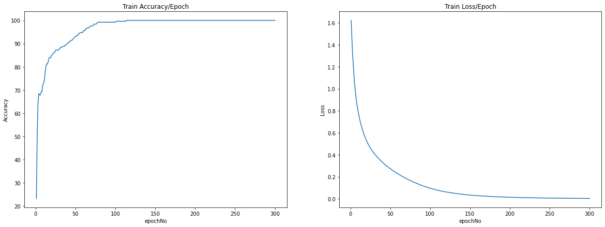
    


<a id="test"></a>
### Testing the model


```python
from sklearn import metrics

y_pred_list = []
with T.no_grad():
    model.eval()
    for test_x, _ in test_loader:
        test_x = test_x.to(device)
        y_test_pred = model(test_x)
        _, y_pred_tags = T.max(y_test_pred, dim = 1)
        y_pred_list.append(y_pred_tags.cpu().numpy())
y_pred_list = [a.squeeze().tolist() for a in y_pred_list]

print("Predicted_values|   Actual_values")
print("-"*33)
for x,y in zip(y_pred_list,test_labels):
    print("\t",x,"\t|\t",y)
```

    Predicted_values|   Actual_values
    ---------------------------------
    	 3 	|	 3
    	 0 	|	 0
    	 0 	|	 0
    	 0 	|	 0
    	 0 	|	 0
    	 2 	|	 1
    	 3 	|	 4
    	 0 	|	 0
    	 0 	|	 0
    	 0 	|	 0
    	 1 	|	 1
    	 1 	|	 2
    	 2 	|	 2
    	 0 	|	 0
    	 1 	|	 1
    	 0 	|	 0
    	 0 	|	 0
    	 0 	|	 0
    	 0 	|	 0
    	 1 	|	 4
    	 1 	|	 1
    	 0 	|	 0
    	 2 	|	 2
    	 0 	|	 0
    	 0 	|	 0
    	 0 	|	 0
    	 0 	|	 0
    	 1 	|	 1
    	 0 	|	 0
    	 0 	|	 0
    	 2 	|	 1
    	 1 	|	 3
    	 0 	|	 0
    	 0 	|	 0
    	 1 	|	 3
    	 0 	|	 0
    	 2 	|	 3
    	 0 	|	 0
    	 1 	|	 2
    	 3 	|	 2
    	 0 	|	 0
    	 0 	|	 0
    	 0 	|	 0
    	 0 	|	 0
    	 1 	|	 2
    	 2 	|	 2
    	 0 	|	 0
    	 0 	|	 0
    	 3 	|	 3
    	 3 	|	 3
    	 1 	|	 3
    	 0 	|	 0
    	 0 	|	 0
    	 0 	|	 0
    	 0 	|	 0
    	 3 	|	 3
    	 0 	|	 0
    	 0 	|	 0
    	 1 	|	 1
    	 2 	|	 1
    

<a id="evaluate"></a>
## Step 3: Evaluating the Classification Model

<a id="acc"></a>
### Total Accuracy and Classification Error


```python
Accuracy = metrics.accuracy_score(test_labels,y_pred_list)
print("Accuracy",Accuracy)
print("Classification Error",1-Accuracy)
```

    Accuracy 0.7833333333333333
    Classification Error 0.21666666666666667
    

<a id="report"></a>
### Calculate Precision, Recall, f1-score, support for each class


```python
print(classification_report(test_labels, y_pred_list))
```

                  precision    recall  f1-score   support
    
               0       1.00      1.00      1.00        35
               1       0.42      0.62      0.50         8
               2       0.43      0.43      0.43         7
               3       0.67      0.50      0.57         8
               4       0.00      0.00      0.00         2
    
        accuracy                           0.78        60
       macro avg       0.50      0.51      0.50        60
    weighted avg       0.78      0.78      0.78        60
    
    

<a id="cm"></a>
### Confusion Matrix


```python
print(metrics.confusion_matrix(test_labels, y_pred_list))
```

    [[35  0  0  0  0]
     [ 0  5  3  0  0]
     [ 0  3  3  1  0]
     [ 0  3  1  4  0]
     [ 0  1  0  1  0]]
    


```python
cm_df = pd.DataFrame(confusion_matrix(test_labels, y_pred_list))
sns.heatmap(cm_df, annot = True)
```


    <AxesSubplot:>


    
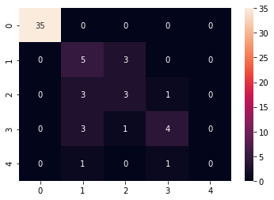
    


#### Binarizing the values


```python
classes = np.array(cleve_pre["class_name"].unique())

test_bin = label_binarize(y_pred_list, classes = classes)
target_bin = label_binarize(test_labels, classes = classes)
n_classes = target_bin.shape[1]

print("NORMAL VALUES   |\tBINARIZE VALUES")
print("-"*40)
for i in range(0,10):
    print(test_labels[i],"\t\t|\t",target_bin[i])
    
```

    NORMAL VALUES   |	BINARIZE VALUES
    ----------------------------------------
    3 		|	 [0 0 0 1 0]
    0 		|	 [1 0 0 0 0]
    0 		|	 [1 0 0 0 0]
    0 		|	 [1 0 0 0 0]
    0 		|	 [1 0 0 0 0]
    1 		|	 [0 0 1 0 0]
    4 		|	 [0 0 0 0 1]
    0 		|	 [1 0 0 0 0]
    0 		|	 [1 0 0 0 0]
    0 		|	 [1 0 0 0 0]
    

<a id="roc5"></a>
### ROC Curve and AUC values for each class
declaring false positive rates (fpr), true positive rates (tpr)


```python
fpr = dict()
tpr = dict()
roc_auc = dict()
```

##### Calculate the fpr, tpr, auc values and all false positive values


```python
for i in range(n_classes):
    fpr[i], tpr[i], _ = roc_curve(target_bin[:,i],test_bin[:,i])
    roc_auc[i] = auc(fpr[i], tpr[i])

all_fpr = np.unique(np.concatenate([fpr[i] for i in range(n_classes)]))

```

##### Calculate mean of true positive values


```python
mean_tpr = np.zeros_like(all_fpr)
for i in range(n_classes):
    mean_tpr += interp(all_fpr, fpr[i], tpr[i])
mean_tpr /= n_classes
```

#### Plot the ROC Curve for 5 classes


```python
plt.figure()
colors = cycle(['aqua', 'orange', 'blue','red','green'])
for i, color in zip(range(n_classes), colors):
    plt.plot(fpr[i], tpr[i], color=color, lw=2,
             label='ROC-class{0}(AUC = {1:0.2f})'
             ''.format(i, roc_auc[i]))

plt.xlim([0.0, 1.0])
plt.ylim([0.0, 1.05])
plt.xlabel('False Positive Rate')
plt.ylabel('True Positive Rate')
plt.title('Receiver operating characteristic of multi-class\n\n')
plt.legend(loc="lower right")
plt.show()   
```


    
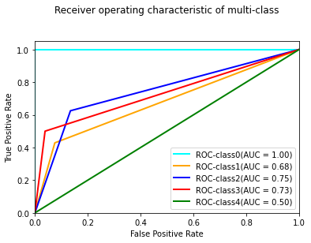
    


<a id="roc"></a>
### ROC Curve for cross-validation (k-Folds = 10)


```python
cv_folds = StratifiedKFold(n_splits = 10)
tprs = []
aucs = []
mean_fpr = np.linspace(0,1,100)
i = 1

x =  cleve_pre.drop("class_name",axis=1)
y = cleve_pre["class_name"]
for train, test in cv_folds.split(x, y):
    xd = T.from_numpy(np.array(x.iloc[train])).float()
    yd = T.from_numpy(np.array(x.iloc[test])).float()
    yl = np.array(y.iloc[test])
    pred_xl = model(xd)
    pred_yl = model(yd)
    _, yl_pred_tags = T.max(pred_yl, dim = 1)
    test_bin = label_binarize(yl_pred_tags.detach().numpy(), classes = classes)
    target_bin = label_binarize(yl, classes = classes)
    
    fpr, tpr, t = roc_curve(target_bin[:, 1],test_bin[:, 1])
    tprs.append(interp(mean_fpr, fpr, tpr))
    roc_auc = auc(fpr, tpr)
    aucs.append(roc_auc)
    plt.plot(fpr, tpr, lw=2, alpha=0.3, label='ROC-fold%d(AUC = %0.2f)' % (i, roc_auc))
    i += 1

plt.plot([0,1],[0,1],linestyle = '--',lw = 2,color = 'black')
mean_tpr = np.mean(tprs, axis=0)
mean_auc = auc(mean_fpr, mean_tpr)
plt.plot(mean_fpr, mean_tpr, color='blue',
         label=r'Mean-ROC(AUC = %0.2f )' % (mean_auc),lw=2, alpha=1)
plt.xlabel('False Positive Rate')
plt.ylabel('True Positive Rate')
plt.title('ROC Curve for 10 folds\n\n')
plt.legend(loc="lower right")
plt.text(0.32,0.7,'Highly accurate',fontsize = 9)
plt.text(0.63,0.4,'Less accurate',fontsize = 9)
plt.show()
```


    
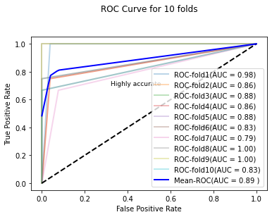
    

